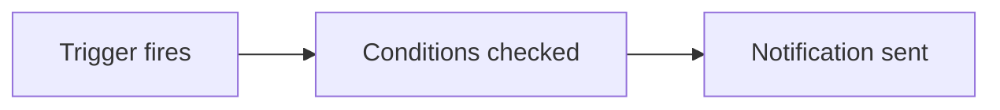

# House style

Read this before writing a page. It is the contract every page in this site follows.

---

## Who we're writing for

Someone who trades their own money and found Tradion through Reddit, Discord, or a Whop community. They are:

- **Smart, but not formally trained.** They know what RSI is because they've used it, not because they took a stats course. They may not know what "heteroskedasticity" or "Sharpe ratio" means, and they will close the tab if you assume they do.
- **Curious about quant, intimidated by code.** They want to run real quantitative analysis. They do not want to learn Python first. A big part of Tradion's promise is that they don't have to.
- **Sceptical of hype.** They've been sold signals, bots, and courses. Overpromising loses them instantly.
- **Impatient.** They will scan before they read. If the first screen doesn't tell them what this page does for them, they leave.

Write for that person. Not for an engineer, not for a fund analyst, not for a complete beginner who's never placed a trade.

---

## The jargon rule

**Every technical term gets explained the first time it appears on a page. Every time, on every page.** Do not assume they read the glossary. Do not assume they read the previous page.

The pattern is: term, then a plain-English gloss in the same sentence.

> ✅ "Set a stop-loss — the price where you automatically exit if the trade goes against you."
>
> ✅ "Tradion computes the **RSI** (Relative Strength Index), a 0–100 score that measures how hard a stock has been pushed in one direction recently."
>
> ❌ "Configure the RSI(14) threshold on the daily timeframe."

Words that always need a gloss on first use: *backtest, volatility, implied volatility, drawdown, Sharpe, correlation, beta, delta, gamma, open interest, VWAP, ATR, Fibonacci, quantitative, regression, distribution, standard deviation, percentile, R:R, FIFO, OPRA, EDGAR, Form 4, options chain, straddle, counterfactual.*

Words we never use because there's always a better one:

| Don't write | Write instead |
| --- | --- |
| utilise, leverage (as a verb) | use |
| facilitate | help, let |
| robust | reliable, or say what it actually does |
| granular | detailed |
| surface (as a verb) | show, find |
| ingest | read, import |
| holistic, synergy, seamless | (delete the sentence and try again) |
| institutional-grade | say what it actually does |

**Never use "simply", "just", "easy", or "obviously".** If it were obvious they wouldn't be reading the page. These words make a stuck reader feel stupid, and a stuck reader who feels stupid churns.

---

## Voice

From `docs/BRAND.md`: **direct, data-first, professional but not cold, zero hype.** In practice:

**Lead with what they do, not with a definition.** A page never opens with "X is a feature that…". It opens with what the reader came to accomplish.

**Second person, present tense, active voice.** "You click Connect" — not "the user should click" or "Connect can be clicked".

**Say the number.** "150 messages a month" beats "generous limits". "About 20 seconds" beats "quickly".

**Name the failure mode.** The most useful paragraph on most pages starts with "this goes wrong when…". Tell them what breaks before they find out themselves.

**Short sentences. One idea each.** If a sentence has two commas and an "and", split it.

**No exclamation marks. No emoji in body text.** Emoji are fine as component `icon` values in frontmatter.

**Never imply a recommendation to trade.** Tradion produces analysis. The reader decides. Write "Tradion rates this setup BUY" — never "you should buy".

---

## Privacy — hard rule

**No real or realistic personal data anywhere in the docs.** Not in prose, not in tables, not in illustrations, not in code samples.

Specifically banned:

- ❌ Real or plausible account balances, portfolio values, or net worth figures
- ❌ Real or plausible P&L amounts in dollars — "you lost $2,140 on this pattern"
- ❌ Any person's name, username, handle, or email other than `support@tradionlabs.com`
- ❌ Broker account numbers, order IDs, or anything shaped like one
- ❌ Screenshots or diagrams containing any of the above

Allowed and encouraged:

- ✅ Public tickers — AAPL, NVDA, BTC/USD, EUR/USD
- ✅ Percentages and ratios — "a 12% drawdown", "3:1 risk/reward"
- ✅ Product limits quoted from `server/config/tiers.js` — "500 messages a month"
- ✅ Placeholder notation in illustrations — `$ ———`, `+ — . — %`, `Account ••••`
- ✅ Generic role labels — "your account", "a connected brokerage"

When an example needs a dollar figure to make sense, restructure it to use a percentage or a ratio instead. If it truly cannot be restructured, use an obviously-fake round number and label it: *"(illustrative figures)"*.

---

## Page structure

```mdx
---
title: "Full page title"
sidebarTitle: "Short"          # only when the title is long
description: "One sentence. Appears in search results and social cards."
icon: "font-awesome-name"
---

One or two sentences: what this page covers and who needs it.
No definitions, no throat-clearing.

<Frame caption="What the reader should notice here.">
  
</Frame>

## First real section
```

Rules:

- **H2 for sections, H3 for subsections.** Never skip a level.
- **A visual within the first screen** on any page that describes a UI.
- **Every page ends by pointing somewhere** — a `<CardGroup>` of next steps, or one clear link.
- **Length: 400–900 words** for a feature page. Reference pages can run longer. If you're past 1,200 words the page should be two pages.
- **State the plan requirement** with `<Info>` at the top of any page describing a gated feature (quant terminal and automations are Trader+).

---

## Components

| Component | Use for |
| --- | --- |
| `<Steps>` | A sequence performed in order. Use liberally — this audience wants step-by-step |
| `<Tabs>` | Mutually exclusive paths (Google vs magic link) |
| `<AccordionGroup>` | Troubleshooting, FAQ, term lists — anything scanned rather than read |
| `<CardGroup>` | Navigation between pages |
| `<Frame caption="">` | Every image. Always with a caption |
| `<Note>` | A useful aside |
| `<Tip>` | Something that makes them better at the product |
| `<Warning>` | Something that costs money, data, or time if ignored |
| `<Check>` | Confirmation a step worked |
| `<Info>` | Plan requirements, cross-references |

Never stack three callouts in a row. If everything is highlighted, nothing is.

Every page describing a feature should contain a **"What this actually means"** or **"In plain English"** subsection where a concept could confuse someone. That's the house signature — do not skip it.

---

## Visuals

Two kinds, and you choose based on what you're explaining.

### Mermaid — write it inline

For flows, sequences, and relationships. Mintlify renders ` ```mermaid ` fences natively. Use these freely; they cost nothing and never go stale.

````

````

Keep them under ~10 nodes. Label nodes in plain English, not with internal names.

### SVG illustrations — reference by slug only

Annotated UI anatomy diagrams live in `images/diagrams/`. **Reference only slugs that exist in `ILLUSTRATIONS.md`.** Do not invent new ones — `npm run verify:nav` will fail the build.

```mdx
<Frame caption="Every part of a verdict card, and what each one is telling you.">
  
</Frame>
```

### Photographic screenshots

`.png` paths are captured by the Playwright pipeline against a seeded demo account and are **not available yet**. Do not add new `.png` references. Use a diagram or Mermaid instead.

**Alt text** describes what is in the image for someone who cannot see it. **Caption** says what the reader should notice. They are different sentences — never duplicate one into the other.

---

## Checklist before you finish a page

- [ ] Every technical term glossed on first use on this page
- [ ] No "simply", "just", "easy", "obviously", "seamless", "leverage"
- [ ] No dollar amounts, balances, P&L figures, names, or account identifiers
- [ ] A visual in the first screen (if the page describes a UI)
- [ ] Plan requirement stated if the feature is gated
- [ ] A "what this actually means" explanation wherever a concept could confuse
- [ ] Failure modes named, not hidden
- [ ] Closing `<CardGroup>` or link
- [ ] Every internal link points at a page in `docs.json`
- [ ] `npm run verify:nav` passes
