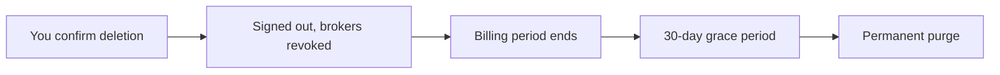

Deleting your account removes everything Tradion holds about you, on a delay. This page explains exactly what happens, how long you have to change your mind, and why deleting is not the same thing as cancelling.

<Warning>
  Deleting is not reversible from inside the app. Once the request goes through you are signed out and cannot sign back in. Undoing it means emailing support before the purge date.
</Warning>

## Where it is

**Settings → Danger Zone → Delete Account**. A dialog opens and asks you to type your account email address. The confirm button stays disabled until it matches exactly.

Administrator accounts cannot delete themselves and will get an error instead.

## What happens the moment you confirm

Four things, in order:

<Steps>
  <Step title="Your subscription is set to cancel at the end of the current period">
    You are not refunded for the remainder of the period you've already paid for.
  </Step>
  <Step title="Every brokerage connection is revoked immediately">
    The links are deleted on Tradion's side and your registration with the brokerage aggregator is removed. This part is not on a delay.
  </Step>
  <Step title="Your account is marked deleted and scheduled for a permanent purge">
    You are signed out and returned to the sign-in screen.
  </Step>
  <Step title="A confirmation email is sent">
    It contains the exact date your data is scheduled to be purged. Keep it.
  </Step>
</Steps>

## The grace period

The permanent purge is scheduled for **30 days after your billing period ends**. If you have no active subscription, it is 30 days from the moment you confirm.

During the grace period your data still exists, but you cannot reach it. Trying to sign in returns a message telling you the account is scheduled for deletion.

## Cancelling a scheduled deletion

There is no self-serve undo button — you can't sign in to press one.

Email **support@tradionlabs.com** from the address on the account, before the purge date in your confirmation email, and ask for the deletion to be reversed. Do it early rather than on the last day; the purge runs on a timer, not on request.

## What deletion removes

When the purge runs, your profile and everything attached to it is deleted from the database in one pass: trades, autopsies and their scores, behavioural patterns, analyses and canvas cells, Lens analyses, earnings reports, chat history, automations and their run history, playbook rules, trading goals, portfolio data, memory entries, and the search vectors built from them.

Some things do not disappear, and it is better to know now than to find out later:

| Kept after deletion | Why |
| --- | --- |
| Billing records held by our payment processor | Legal and tax retention, on their schedule, not ours |
| The payment webhook audit log | Kept one year for financial auditing |
| Error logs held by our error-monitoring provider | Their retention, up to 90 days |
| Database backups | Deleted data can persist in backups for up to 30 further days |
| Anonymised, aggregated data | Once identifiers are stripped it can no longer be traced to you, and cannot be pulled back out |

The full, authoritative version of that list is in the [Privacy Policy](https://tradionlabs.com/privacy).

## Export your data first

There is no one-click account export in the app. What you can save yourself before deleting:

- **Quant research** — export the code and notebook from a canvas session. See [the canvas](/research/the-canvas).
- **Everything else** — email support@tradionlabs.com and request a copy of your data. You have a right to it in a structured, machine-readable format, and the request needs to be made before the purge date, not after.

<Tip>
  Do the export request first, get the file, and only then delete. Once the purge runs there is nothing left to export.
</Tip>

## Deleting vs cancelling

People confuse these constantly. They are different actions with different buttons.

| | Cancel subscription | Delete account |
| --- | --- | --- |
| Where | Settings → Subscription & Billing → Manage | Settings → Danger Zone |
| Billing stops | At the end of the period | At the end of the period |
| Can you sign in afterwards | Yes | No |
| Your trades, autopsies, and memory | Kept | Permanently deleted after the grace period |
| Automations | Switched off, kept | Deleted |
| Brokerage connections | Kept | Revoked immediately |
| Reversible | Yes — resubscribe any time | Only by emailing support before the purge date |

If what you want is to stop paying, cancel. Cancelling keeps the account and everything in it, and you can come back later with your history intact — see [managing your subscription](/account/managing-subscription).

<CardGroup cols={2}>
  <Card title="Managing your subscription" icon="receipt" href="/account/managing-subscription">
    Cancel without losing anything.
  </Card>
  <Card title="Contact support" icon="envelope" href="/help/contact">
    Reverse a deletion, or request a data export.
  </Card>
</CardGroup>
