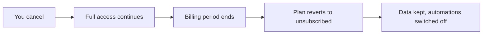

Everything to do with your plan lives in one place: **Settings → Subscription & Billing**. This page covers what each action does to your account, including the parts that surprise people.

Prices and what each tier includes are on the [plan comparison](/reference/plan-comparison) page.

## Where to find it

Open **Settings**. The **Subscription & Billing** panel shows your current plan, a status line, your monthly usage meters, and a list of what your plan includes.

Two buttons sit at the top right of that panel:

- **Manage** opens the Stripe billing portal — the hosted page where Stripe, our payment processor, lets you change plan, update your card, download invoices, and cancel. Tradion never handles your card details.
- **Sync** pulls your live subscription state from Stripe and rewrites it into Tradion. Use it if you changed something in the portal and the app still shows the old plan.

## Upgrading

Click the upgrade link under **Plan includes**, or open **Manage** and change your plan there. Either route lands you on a Stripe confirmation screen showing the new price and what you will be charged now.

The moment Stripe confirms the upgrade, Tradion grants you the **full monthly allowance of the new tier** — not a pro-rated slice of it. If you were on Trader with 3 quant sessions left and upgrade to Quant, you get Quant's full 300, immediately. See [usage limits](/concepts/usage-limits) for what each meter counts.

<Check>
  Your plan should update within a few seconds. If it doesn't, click **Sync**.
</Check>

## Downgrading

Downgrading uses the same **Manage** button. Stripe's confirmation screen tells you when the change takes effect and what, if anything, is billed or credited — read it before confirming, because that timing is set by Stripe, not by Tradion.

What Tradion does when the downgrade lands is fixed:

- Your remaining balances are **capped**, never topped up. If you had 200 chat messages left and drop to a tier with a 150 ceiling, you keep 150. If you had 40 left, you keep 40.
- A downgrade never resets your meters mid-cycle. Only a renewal or an upgrade does that.
- Features above your new tier stop working at the moment the tier changes.

<Warning>
  Subscription fees are non-refundable, including for the unused part of a period you downgrade out of. If you think you've been charged in error, email support@tradionlabs.com within 30 days of the charge.
</Warning>

## Payment method and invoices

Both live inside **Manage**. Update your card, change your billing address, and download past invoices there. Stripe emails you before a card expires and ahead of each renewal.

## Subscription statuses

The status line under your plan name is Stripe's status, passed through unchanged.

| Status shown | What it means | Do you still have access? |
| --- | --- | --- |
| ● Active | Paid and current | Yes |
| ● Trial — ends *date* | Inside the 7-day free trial | Yes |
| ● Past Due | A payment failed | Yes — see below |
| Cancels *date* | Cancelled, still inside the paid period | Yes, until that date |
| ● Canceled | The period has ended | No |
| Refunded — pending review | A refund was processed on the charge | Yes, pending review |
| Disputed — contact support | A chargeback was opened on the charge | Yes, pending review |
| ○ Inactive | No subscription | No |

## When a payment fails

Your account moves to **Past Due**. Tradion keeps your access on during this state — you are not locked out the day a card bounces.

Stripe then retries the charge on its own schedule and emails you a link to update your card. Tradion does not set that retry window, so no number of days can be quoted here — Stripe's emails are the timeline. Update your card through **Manage** and the account returns to Active on the next successful charge.

### In plain English

Past Due is a warning, not a lock. The lock comes later, when Stripe gives up and cancels the subscription outright.

## Cancelling

Open **Manage** and cancel in the Stripe portal. Cancellation is scheduled, not instant:

Until the period ends, nothing changes. The panel shows **Cancels *date*** and a note that all features remain available until then.

When the period ends:

- Your plan reverts to unsubscribed and all three usage meters go to zero.
- **Every automation you own is switched off.** They are not deleted — they are set inactive, and after resubscribing you switch them back on one at a time. Nothing turns them on for you, and an automation left off is still a paused automation, not a deleted one.
- Your data is kept. Trades, autopsies, analyses, memory, and playbook rules are all still there.

## Reactivating

While the cancellation is still pending, a **Reactivate** button appears next to the cancellation notice. It opens the Stripe portal, where you undo the scheduled cancellation and carry on with no gap.

If the period has already ended, subscribe again from **Settings → Subscription & Billing**. Your data comes back with you. The 7-day free trial does not — it is once per account, not once per subscription.

<CardGroup cols={2}>
  <Card title="Plan comparison" icon="table-columns" href="/reference/plan-comparison">
    Prices, features, and limits side by side.
  </Card>
  <Card title="Usage limits" icon="gauge-high" href="/concepts/usage-limits">
    What each meter counts and when it resets.
  </Card>
</CardGroup>
