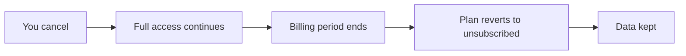

Everything to do with your plan lives in one place: **Settings → Subscription & Billing**. This page covers what each action does to your account, including the parts that surprise people.

Prices and what each tier includes are on the [plan comparison](/reference/plan-comparison) page.

## Where to find it

Open **Settings**. The **Subscription & Billing** panel shows your current plan, a status line, your monthly usage meters, and a list of what your plan includes.

Two buttons sit at the top right of that panel:

- **Manage** opens the Stripe billing portal, the hosted page where Stripe, our payment processor, lets you change plan, update your card, download invoices, and cancel. Tradion never handles your card details.
- **Sync** pulls your live subscription state from Stripe and rewrites it into Tradion. Use it if you changed something in the portal and the app still shows the old plan.

## Upgrading

Click the upgrade link under **Plan includes**, or open **Manage** and change your plan there. Either route lands you on a Stripe confirmation screen showing the new price and what you will be charged now.

Upgrading from Starter to Pro charges you the prorated difference for the rest of your current billing period immediately. The moment that charge succeeds, Tradion grants you **Pro's full monthly allowance**, not a pro-rated slice of it. If you were on Starter with 3 Earnings Deep Research messages left, you get Pro's full 25, immediately. If you upgrade during your free trial, the trial ends immediately and you are charged for Pro right away. See [usage limits](/concepts/usage-limits) for what each counter counts.

<Check>
  Your plan should update within a few seconds. If it doesn't, click **Sync**.
</Check>

## Downgrading

Downgrading uses the same **Manage** button. From Pro to Starter takes effect **immediately**, not at the end of your billing period, and the prorated difference is credited toward your future invoices rather than refunded in cash.

What Tradion does when the downgrade lands is fixed:

- Your remaining balances are **capped**, never topped up. If you had 200 AI Portfolio Analyst messages left and drop to Starter's 120 ceiling, you keep 120. If you had 40 left, you keep 40.
- A downgrade never resets your counters mid-cycle. Only a renewal or an upgrade does that.
- Every feature stays available: Starter and Pro include the same features, so nothing you use stops working, only the monthly allowance changes.

<Warning>
  Subscription fees are non-refundable in cash. A downgrade's prorated difference is credited toward future invoices instead. If you think you've been charged in error, email contact@tradionlabs.com within 30 days of the charge.
</Warning>

## Payment method and invoices

Both live inside **Manage**. Update your card, change your billing address, and download past invoices there. Stripe emails you before a card expires and ahead of each renewal.

## Subscription statuses

The status line under your plan name is Stripe's status, passed through unchanged.

| Status shown | What it means | Do you still have access? |
| --- | --- | --- |
| ● Active | Paid and current | Yes |
| ● Trial, ends *date* | Inside the 3-day free trial | Yes |
| ● Past Due | A payment failed | Yes, see below |
| Cancels *date* | Cancelled, still inside the paid period | Yes, until that date |
| ● Canceled | The period has ended | No |
| Refunded, pending review | A refund was processed on the charge | Yes, pending review |
| Disputed, contact support | A chargeback was opened on the charge | Yes, pending review |
| ○ Inactive | No subscription | No |

## When a payment fails

Your account moves to **Past Due**. Tradion keeps your access on during this state. You are not locked out the day a card bounces.

Stripe then retries the charge on its own schedule and emails you a link to update your card. Tradion does not set that retry window, so no number of days can be quoted here, Stripe's emails are the timeline. Update your card through **Manage** and the account returns to Active on the next successful charge.

### In plain English

Past Due is a warning, not a lock. The lock comes later, when Stripe gives up and cancels the subscription outright.

## Cancelling

Open **Manage** and cancel in the Stripe portal. Cancellation is scheduled, not instant:

```mermaid
flowchart LR
    A["You cancel"] --> B["Full access continues"]
    B --> C["Billing period ends"]
    C --> D["Plan reverts to unsubscribed"]
    D --> E["Data kept"]
```

Until the period ends, nothing changes. The panel shows **Cancels *date*** and a note that all features remain available until then.

When the period ends:

- Your plan reverts to unsubscribed and all six usage counters go to zero.
- Your data is kept. Trades, autopsies, analyses, memory, and playbook rules are all still there.

## Reactivating

While the cancellation is still pending, a **Reactivate** button appears next to the cancellation notice. It opens the Stripe portal, where you undo the scheduled cancellation and carry on with no gap.

If the period has already ended, subscribe again from **Settings → Subscription & Billing**. Your data comes back with you. The 3-day free trial does not. It is once per account, not once per subscription.

<CardGroup cols={2}>
  <Card title="Plan comparison" icon="table-columns" href="/reference/plan-comparison">
    Prices, features, and limits side by side.
  </Card>
  <Card title="Usage limits" icon="gauge-high" href="/concepts/usage-limits">
    What each counter counts and when it resets.
  </Card>
</CardGroup>
