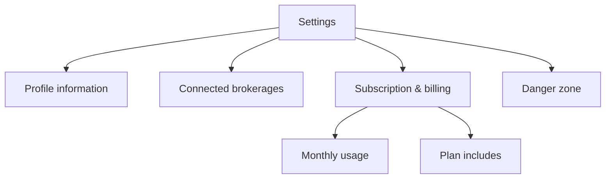

One screen holds everything about your account: who you are, which brokerages are linked, what you're paying for, how much of your monthly allowance is left, and how to delete the whole thing. This page is a tour of each panel, top to bottom.

<Frame caption="Settings. Profile details, connected brokerages, and your subscription, in one place.">
  
</Frame>

## Profile information

Your display name and your email address.

The name is editable, click **Edit**, change it, click **Save Changes**. The email address is fixed and cannot be changed from here, because it is the identifier your sign-in and your billing are both tied to. If you need it changed, email contact@tradionlabs.com.

## Connected brokerages

Every brokerage account you've linked, with a status dot, the accounts inside it, and when it last synced.

- **Sync Trades** pulls fresh positions and trade history for that connection.
- **Disconnect** removes the connection and its cached data.
- **Reconnect** appears in place of Sync when a connection shows **Expired**, brokers expire their authorisations periodically, and always after you change your password or reset two-factor authentication.
- **+ Add** opens the connection portal to link another broker.

The connection is read-only in both directions: Tradion can see positions and trades, and has no way to place, change, or cancel an order.

Full walkthrough: [connecting a brokerage](/portfolio/connect-brokerage).

## Subscription and billing

Your plan name, a status line, and two buttons, **Sync** (pull your live plan state from the payment processor) and **Manage** (open the hosted billing portal to change plan, update your card, get invoices, or cancel).

If you've cancelled but your paid period hasn't ended yet, a notice appears here with the end date and a **Reactivate** button.

Every action in this panel, and what each status means, is covered in [managing your subscription](/account/managing-subscription).

## Monthly usage

Three meters, each showing *remaining / total* with a bar, plus the date they reset:

- **AI Asset Manager Messages**, your portfolio chat.
- **Agent Runs**, executions of an AI agent step inside an automation. Trader and Quant only.
- **Quant Sessions**, analyses started in the quant research terminal, where Python runs in a sandbox. Trader and Quant only.

The bar turns amber when a meter is running low and red at zero, and a small **Upgrade** button appears beside it.

### What this actually means

The meters count *remaining*, not *used*. A bar that is nearly empty means you are nearly out. Unused credits do not carry into next month, see [usage limits](/concepts/usage-limits).

## Plan includes

A checklist of what your current tier gives you, and a one-line link to the next tier up if there is one. It is a summary, not the full grid. That's on the [plan comparison](/reference/plan-comparison) page.

## Notifications

There is no account-wide notification setting. Alert delivery is configured **per automation**, on the automation itself: which channels to send to, and the Discord webhook address, Telegram chat, email address, or webhook endpoint for each.

That means there is no global mute. To stop alerts, pause or edit the automation sending them. See [notifications](/automations/notifications).

## Danger zone

A single **Delete Account** button, at the bottom, in red. It opens a confirmation dialog that makes you type your account email before it will do anything.

<Warning>
  Deleting your account is not the same as cancelling your subscription. Cancelling stops the billing and keeps your data. Deleting schedules everything for permanent removal. Read [deleting your account](/account/deleting-your-account) before you touch this.
</Warning>

<CardGroup cols={2}>
  <Card title="Managing your subscription" icon="receipt" href="/account/managing-subscription">
    Upgrades, downgrades, failed payments, cancellation.
  </Card>
  <Card title="Deleting your account" icon="trash" href="/account/deleting-your-account">
    What gets removed, and the window to change your mind.
  </Card>
</CardGroup>
