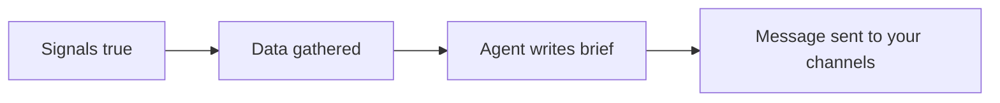

<Info>
  Automations need the **Trader** plan or above, and Agent nodes spend from your monthly agent-run allowance — 50 a month on Trader, 500 on Quant. See [usage limits](/concepts/usage-limits).
</Info>

A price alert tells you a number moved. An Agent node tells you what was going on around it. Drop one between your signals and your Action node: when the automation fires, Tradion researches the ticker first and puts the findings in the same message.

## What happens when the trigger fires

The signals go true, Tradion pulls the data the agent needs, and the agent reads it and writes up what it found. Only then do notifications go out, so every channel carries the finished analysis rather than a bare alert followed by a second message.



Most agents finish inside five minutes; the Market Brief agent is given up to twelve.

### In plain English

Attaching an agent buys you context and costs you speed. The alert now waits for the research, so it lands minutes after the trigger rather than seconds after it. Too slow for a scalp entry. Fine for a swing setup, a news event, or an earnings run-up.

## The agents you can add

Six types sit behind the **+ Agent** toolbar button, and each can be added once — so six agent nodes is the practical ceiling on one canvas. They run in sequence, analysts first and the Report Writer last, with an order badge on each node.

| Agent | What it produces |
| --- | --- |
| **Research Agent** | Raw findings from filings, earnings calls, news, and the open web |
| **Fundamental Analyst** | Valuation, growth, margins, earnings quality, and peer comparison |
| **Sentiment Analyst** | A read on news, social chatter, insider activity, and options flow |
| **Chart Analyst** | A visual read of the chart, with a BUY / SELL / WAIT call and levels |
| **Market Brief** | A portfolio and watchlist digest — indices, macro, sectors, movers |
| **Report Writer** | One synthesised memo built from whatever the agents above produced |

The Report Writer is the only one that reads other agents' output rather than raw data. Add it when you have two or more analysts on the canvas and want a single coherent note instead of three separate blocks.

## What the agent can look at

There are 24 research tools, and **every one of them is read-only**. No tool can place, change, or cancel an order. What the agent can reach:

- **Filings** — company reports filed with the SEC: annual (10-K), quarterly (10-Q), and event (8-K), searchable down to individual sections
- **Earnings call transcripts** — what management said, and how it read
- **News and news sentiment** — the article feed plus a scored read of its tone
- **Fundamentals** — revenue, margins, cash flow, balance sheet, analyst estimates
- **Insider activity** — Form 4 filings, the disclosures company insiders must make within two business days of trading their own stock
- **Corporate actions** — dividends, splits, mergers, spin-offs
- **Social sentiment** — Reddit trading communities, read for the bullish/bearish balance
- **Web search** — press releases, analyst commentary, anything public not in the feeds above
- **Options chain** — the live contracts on the name, including **open interest**, the number of contracts currently held open by somebody
- **Technical indicators and price history** — bars, snapshots, and the readings calculated on top of them

Each agent type gets the subset that fits its job. The tools an individual run used are listed on its detail page.

## Configuring a Research Agent

```yaml
sources:  sec_filings, earnings_transcripts, news_sentiment   # default
          + corporate_actions, web_search                     # optional
lookback: 1Q | 2Q | 1Y | 2Y      # default 1Y
focus:    Revenue Growth, Debt Analysis, Management Changes,
          Risk Factors, Competitive Position, Margin Trends   # optional
```

**Lookback** is how far back the agent searches filings, transcripts, and news. **Focus areas** are optional: leave them empty for a general read, or pick two or three to pull the whole brief toward those subjects. Every agent also has a free-text instruction box capped at 500 characters — use it for the specific question you have.

## What comes back

Every agent returns the same shape, whatever its type:

- A **direction** — bullish, bearish, or neutral
- A **conviction** score from 1 to 10
- A one-sentence summary, under 25 words
- **Sections** of dense bullet points, each bullet one fact
- **Exactly three key risks**

You choose the Report Writer's sections. Six are always available — Executive Summary, Technical Analysis, Trade Plan, Position Sizing, Action Items, Scenario Analysis — and others unlock only when the agent that supplies them is on the canvas: Peer Comparison needs the Fundamental Analyst, Catalyst Calendar the Research Agent, Options Strategy the Sentiment Analyst. The picker greys out the rest.

<Warning>
  A section called "Trade Plan" is generated analysis, not instruction. Tradion cannot place trades and does not know your account. Entry, stop, and target numbers in an automated brief are one model's reading of one moment, produced without you in the room.
</Warning>

## What it costs, and how to not waste it

**One agent run per agent, per fire.** Three analysts on a canvas is three runs every time that automation triggers. The Report Writer is the exception — it synthesises what is already there and consumes nothing.

Runs are refunded when an agent fails or times out. There are also burst limits of 20 runs an hour and 100 a day across your whole account.

<Tip>
  The reliable way to burn an allowance is to attach an agent to a high-frequency trigger. Before you add one, look at what the signal alone does for a week in the [Runs tab](/automations/runs-and-history). A signal that fires twice a month can carry three agents on Trader. A signal that fires twice a day cannot carry one.
</Tip>

If the allowance runs out mid-month, the automation keeps firing and keeps notifying you — the alert arrives without the analysis, and the run is marked **degraded** or **failed** in the Runs tab. Allowances reset at your billing date.

## Reading the results

Agent output arrives in two places: inside the notification, and on the run's detail page under **Automations → Runs**. The detail page is the fuller version — see [runs and history](/automations/runs-and-history).

## Which model runs

| Plan | Model |
| --- | --- |
| Trader | Claude Sonnet |
| Quant | Claude Opus |

The Chart Analyst always runs on Sonnet, whatever your plan, because it is the model that reads images. Model detail: AI models.

## Next

<CardGroup cols={2}>
  <Card title="Notification channels" icon="paper-plane" href="/automations/notifications">
    Where the brief gets delivered, and how to word it.
  </Card>
  <Card title="Runs and history" icon="clock-rotate-left" href="/automations/runs-and-history">
    Read what each agent did, step by step.
  </Card>
</CardGroup>
