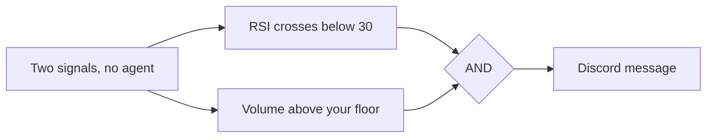

<Info>
  Automations need the **Trader** plan or above. Starter accounts cannot create one. See [plans](/reference/plan-comparison).
</Info>

You describe a setup once: an instrument, the conditions that define it, and where you want to hear about it. Tradion watches for it around the clock and messages you when every condition is true at the same time.

<Frame caption="Read it left to right. Only the first and last nodes are compulsory.">
  
</Frame>

And the same chain on the real canvas, built out about as far as it goes:

<Frame caption="One asset, a schedule, three signals joined by AND, six agents in order, and the action drawer on the right. Yours will start with two nodes.">
  
</Frame>

## What an automation is not

An automation alerts you. It does not trade for you. **Tradion cannot place, change, or cancel an order.** There is no order node on the canvas, and connected brokerage accounts are read-only. When a research agent writes something that reads like a trade plan, that is generated text inside a message. Every click that costs money stays with you.

## The six node types

| Node | How many | What it does |
| --- | --- | --- |
| **Asset** | Exactly one | The stock, crypto pair, forex pair, options contract, or whole market being watched |
| **Signal** | Up to 10 | One condition: price, indicator, volume, change %, news, earnings, options flow, insider filing, corporate action |
| **Logic** | Appears on its own | Shows up when you add a second signal. Click it to switch between AND and OR |
| **Schedule** | Optional, one | A clock trigger, or a time gate on your signals |
| **Agent** | One of each of six types | Hands the trigger to an AI research agent before the message goes out |
| **Action** | Exactly one | The channels, the message wording, Personal Insights, and the cooldown |

Every automation needs an Asset and an Action, plus **either at least one Signal or a Schedule**. Save without one and the canvas refuses with `At least one signal or schedule is required.` It also refuses an unnamed automation, a missing ticker (unless the asset type is Market), and any signal left without a value.

## The Schedule node

Add it from the toolbar to run an automation on a clock rather than on market movement. It holds a time, a set of weekdays, and a timezone, and shows you both a plain summary and the underlying expression: *Weekdays at 9:30 AM ET · 30 9 \* \* 1-5*.

Four presets cover the usual times: **Pre-market** (9:25 AM weekdays), **Market open** (9:30 AM), **Post-close** (4:15 PM), and **Weekly** (Sunday 8 PM). Or set it yourself: any hour, minutes in steps of five, any combination of days (at least one), and one of eight timezones from New York through London to Tokyo. Times are read in the timezone you pick, and it follows daylight saving, so a 9:30 AM ET schedule stays at the opening bell all year.

It behaves in two ways, and the difference matters:

- **On its own**, it fires the automation at each scheduled time regardless of what the market is doing. This is how you get a morning briefing: a Market asset, a Schedule, and a Market Brief agent, with no signals at all.
- **Alongside signals**, it becomes a gate. Your conditions are only checked in a roughly 90-second window around each scheduled time, and they must be true at that moment.

<Warning>
  That gate is narrow. "Weekdays at 9:30" plus an RSI condition means the RSI is looked at once a day, for about a minute and a half. If it goes oversold at 11 AM, nothing fires. Use a schedule with signals when you want a daily check-in on a level, not when you want to catch a move.
</Warning>

## Two ways to start

Click **New automation** and you get a choice screen.

<Tabs>
  <Tab title="Use a template">
    45 pre-built automations in seven categories: Price Action, Technical, Event-Driven, Crypto, Risk Management, Multi-Agent Strategies, and Scheduled Briefs. Each row shows its conditions, its agents, its channel count, and a Beginner / Intermediate / Advanced label. Picking one drops a fully wired canvas in front of you. Change the ticker first.
  </Tab>
  <Tab title="Start from scratch">
    A blank canvas with an Asset node and an Action node already placed and connected. Add signals and agents from the toolbar. This is the path [Building your first automation](/automations/first-automation) walks through.
  </Tab>
</Tabs>

Both land in the same editor. There is one builder in Tradion, the canvas, and a template is a starting position on it rather than a separate simplified mode.

## Active, paused, and triggered

An automation is either **Active** or **Paused**. There is no third state, and the toggle sits on its card.

The list also has a **Triggered** filter tab, which is not a state: it narrows the list to automations that have fired at least once. The **Runs** tab beside it shows every execution across all your automations, and that is where you go to debug. See [runs and history](/automations/runs-and-history).

<Frame caption="The automations list. Filter tabs across the top, one card per automation, and your agent-run balance beside the create button.">
  
</Frame>

Active automations are re-checked **every 60 seconds**. If every signal is a price or volume check on a US stock, Tradion also watches the live trade feed between 9:30 AM and 4:00 PM ET and reacts within about a second. Everything else runs on the 60-second cycle.

<Note>
  Checks do not stop when the market closes. Outside trading hours Tradion evaluates against the last known price, so an overnight news or corporate-action signal still fires. Crypto runs continuously.
</Note>

### In plain English

Nothing about an automation is scheduled around your day unless you add a Schedule node. Once a minute, for every Active automation you own, Tradion asks whether all its conditions are true at that instant. If they are and no cooldown is running, the message goes out. Nobody watches the gaps between checks, so a condition that flickers true for ten seconds may never be seen, and one that stays true all week fires once, waits out the cooldown, then fires again.

## How many you can run

| Plan | Automations | Agent runs per month |
| --- | --- | --- |
| Starter | 0 | 0 |
| Trader | 10 | 50 |
| Quant | 50 | 500 |

The automation count is a total, not a count of running ones. Pausing does not free a slot, so on Trader you delete something before you can create an eleventh. Agent runs are metered separately and only spend when an Agent node is on the canvas. Full detail: [usage limits](/concepts/usage-limits).

## Next

<CardGroup cols={2}>
  <Card title="Build one end to end" icon="wand-magic-sparkles" href="/automations/first-automation">
    A ten-minute walkthrough with a real ticker.
  </Card>
  <Card title="All 45 templates" icon="layer-group" href="/automations/templates">
    Every ready-made automation, grouped by category.
  </Card>
  <Card title="Operators" icon="arrow-right-arrow-left" href="/automations/operators">
    The one setting that decides how loud an automation is.
  </Card>
  <Card title="All nine signal types" icon="signal" href="/automations/signal-types">
    Every parameter, and which work with which asset.
  </Card>
  <Card title="The Action node" icon="paper-plane" href="/automations/notifications">
    Channels, Personal Insights, template, cooldown.
  </Card>
</CardGroup>
