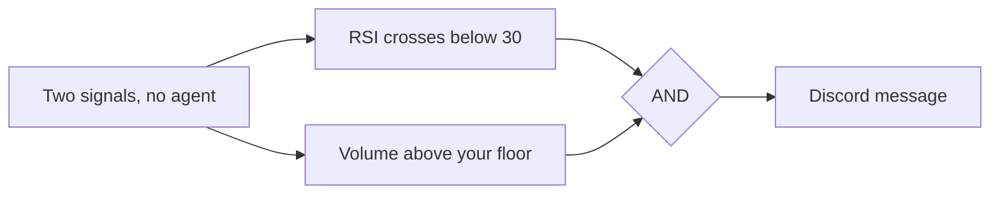

<Info>
  Automations need the **Trader** plan or above. Starter accounts cannot create one. See [plans](/reference/plan-comparison).
</Info>

You describe a setup once — an instrument, the conditions that define it, and where you want to hear about it. Tradion watches for that setup around the clock and messages you when every condition is true at the same time.

<Frame caption="Read it left to right. Only the first and last nodes are compulsory.">
  
</Frame>

<Frame caption="The automations list. Filter tabs across the top, one card per automation, and your agent-run balance beside the create button.">
  
</Frame>

## What an automation is not

An automation alerts you. It does not trade for you. **Tradion cannot place, change, or cancel an order.** There is no order node on the canvas, and connected brokerage accounts are read-only. When a research agent writes something that reads like a trade plan, that is generated text inside a message — nothing has been sent to a broker. Every click that costs money stays with you.

## The five node types

| Node | Required | What it does |
| --- | --- | --- |
| **Asset** | Yes, exactly one | The stock, crypto pair, forex pair, or options contract being watched |
| **Signal** | Up to 10 | One condition — price, indicator, volume, change %, news, earnings, options flow, insider filing, corporate action |
| **Logic** | Appears on its own | Shows up when you add a second signal. Click it to switch between AND and OR |
| **Agent** | One of each type, six types | Hands the trigger to an AI research agent before the message goes out |
| **Action** | Yes, exactly one | The channels the alert goes to, the message wording, and the cooldown |

There is also an optional **Schedule** node. On its own it fires the automation on a clock — weekdays at 9:25 AM, say — with no market condition involved. Alongside signals it works as a time gate: signals are only checked inside the scheduled window.

Every automation needs an Asset and an Action, plus **either at least one Signal or a Schedule**. Save without one of those and the canvas refuses with `At least one signal or schedule is required.`

## Two ways to start

Click **New automation** and you get a choice screen.

<Tabs>
  <Tab title="Use a template">
    45 pre-built automations in seven categories: Price Action, Technical, Event-Driven, Crypto, Risk Management, Multi-Agent Strategies, and Scheduled Briefs. Each row shows its conditions, its agents, its channel count, and a Beginner / Intermediate / Advanced label. Picking one drops a fully wired canvas in front of you — change the ticker first.
  </Tab>
  <Tab title="Start from scratch">
    A blank canvas with an Asset node and an Action node already placed and connected. You add signals and agents from the toolbar above the canvas. This is the path [Building your first automation](/automations/first-automation) walks through.
  </Tab>
</Tabs>

Both land in the same editor. There is one builder in Tradion — the canvas — and a template is a starting position on it, not a separate simplified mode.

## Active, paused, and triggered

An automation is either **Active** or **Paused**. There is no third state. The toggle sits on the automation's card.

The list also has a **Triggered** filter tab, which is not a state — it narrows the list to automations that have fired at least once. The **Runs** tab beside it shows every execution across all your automations, and that is where you go when something needs debugging. See [runs and history](/automations/runs-and-history).

Active automations are re-checked **every 60 seconds**. If every signal on an automation is a price or volume check on a US stock, Tradion also watches the live trade feed between 9:30 AM and 4:00 PM ET and reacts within about a second. Everything else runs on the 60-second cycle.

<Note>
  Checks do not stop when the market closes. Outside trading hours Tradion evaluates against the last known price, so an overnight news or corporate-action signal still fires. Crypto runs continuously.
</Note>

### In plain English

Nothing about an automation is scheduled around your day. Once a minute, for every Active automation you own, Tradion asks whether all its conditions are true at that instant. If they are and no cooldown is running, the message goes out. Nobody watches the gaps between checks, so a condition that flickers true for ten seconds may never be seen — and a condition that stays true all week fires once, then waits out the cooldown, then fires again.

## Cooldowns

A **cooldown** is a minimum quiet period after a trigger. Once an automation fires, it will not fire again until the cooldown has elapsed, no matter how many times the condition goes on being true.

You set it on the Action node, choosing from 5m, 15m, 1h, 4h, and 1d. A new automation defaults to **1 hour**. Those five presets are the whole choice in the builder — templates arrive carrying other values, and anything from 1 minute to 31 days is accepted.

<Tip>
  A cooldown mutes repeats; it does not fix a badly written condition. If an alert repeats because you chose *Goes Above (continuous)* where you wanted *Crosses Above (one-shot)*, change the operator first — see [operators](/automations/operators).
</Tip>

## How many you can run

| Plan | Automations | Agent runs per month |
| --- | --- | --- |
| Starter | 0 | 0 |
| Trader | 10 | 50 |
| Quant | 50 | 500 |

The automation count is a total, not a count of running ones. Pausing one does not free a slot — on Trader you delete something before you can create an eleventh. Agent runs are metered separately and only spend when an Agent node is on the canvas. Full detail: [usage limits](/concepts/usage-limits).

## Next

<CardGroup cols={2}>
  <Card title="Build one end to end" icon="wand-magic-sparkles" href="/automations/first-automation">
    A ten-minute walkthrough with a real ticker.
  </Card>
  <Card title="Operators" icon="arrow-right-arrow-left" href="/automations/operators">
    The one setting that decides how loud an automation is.
  </Card>
  <Card title="All nine signal types" icon="signal" href="/automations/signal-types">
    Every parameter, and which work with which asset.
  </Card>
  <Card title="Notification channels" icon="paper-plane" href="/automations/notifications">
    Discord, email, Telegram, in-app, and your own webhook.
  </Card>
</CardGroup>
