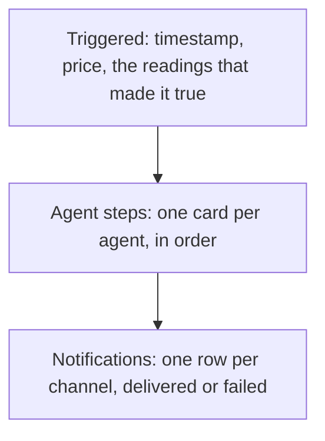

<Info>
  Automations need the **Trader** plan or above. See [plans](/reference/plan-comparison).
</Info>

When an automation behaves in a way you didn't expect, the answer is almost always in **Automations → Runs**. This page is how to read it, plus an ordered set of checks for the two questions that come up most: why nothing fired, and why nothing arrived.

## The Runs tab

Runs is one feed of every execution across all your automations, newest first, 20 at a time. Each card carries the automation name, the ticker, the trigger, the price at the time, how many agents ran, how many notifications landed out of how many were attempted, and a status.

| Status | What it means |
| --- | --- |
| **Triggered** | Conditions became true and notifications went out. No agents involved |
| **Running** | Still going. Agents are working |
| **Completed** | Everything finished, every agent succeeded |
| **Degraded** | Some agents finished, some didn't. The output is real but incomplete |
| **Failed** | Every agent failed, or the run never completed |

A run stuck on **Running** for more than 20 minutes is automatically marked Failed. Seeing that repeatedly on one automation means the agents are timing out rather than erroring, usually too many agents on one canvas. Six agents are estimated at about 15 minutes, so a full canvas has little room before the 20-minute cut-off. The Action node prints that estimate: see [the AI Agent node](/automations/ai-agent-node).

## Reading a single run

Click a run and you get a timeline in three parts.

**Triggered** shows the exact conditions that became true and the readings behind them. If the trigger reads as something you didn't intend, the problem is in the signal, not downstream.

**Agent steps** are collapsible, one per agent. Expand one for the tools it used, how long it took, its summary, key findings, every section it wrote, and its three risks. A failed agent shows its error here.

**Notifications** lists each channel with **Delivered** or **Failed**, the number of attempts, and the error text when there is one. This is the section that answers "the automation fired but I never saw it".

While a run is still going the page refreshes itself every ten seconds. For one automation's history rather than all of them, open the automation and click its trigger history.

### In plain English

A run is one moment when every condition on an automation was true at once. No run means nothing ever became true, which is a signal problem. A run with no message means something became true and the delivery failed, which is a channel problem. They are unrelated, and the Runs tab tells them apart in five seconds.

## Why didn't my automation fire

Work through these in order; each rules out a whole class of cause.

<Steps>
  <Step title="Is there a run for it?">
    **If a run exists, it did fire**, so your problem is delivery. Skip to the next section. If no run exists, carry on.
  </Step>
  <Step title="Is the toggle on Active?">
    Paused automations are never evaluated. Check your subscription too: a lapsed one stops the checks, and a cancelled one pauses the automations outright.
  </Step>
  <Step title="Is it inside a cooldown?">
    The card shows when it last triggered. If that was less than the cooldown ago, the next trigger is suppressed. Default cooldown on a new automation is one hour.
  </Step>
  <Step title="Did the value ever transition through the level?">
    After its first check, a crossing operator only fires on a transition. If the reading has sat on one side of your level the whole time, there has been no crossing to catch. Confirm on a chart that the value actually moved through it. See [operators](/automations/operators).
  </Step>
  <Step title="Is it an event signal on its first check?">
    News, insider transactions, and corporate actions record a starting point on their first check and fire only on items newer than that. They never fire on something already published when you built the automation.
  </Step>
  <Step title="Are your AND conditions ever true at the same instant?">
    AND requires every signal to be true on the **same** check, not on the same day. A volume threshold that only holds in the first ten minutes and an indicator that only turns over in the afternoon never coincide. Switch to OR, loosen one threshold, or split it into two automations.
  </Step>
  <Step title="Does the timeframe match your expectation?">
    A daily indicator is evaluated once per day, at the close. Set one up at lunchtime expecting an alert that afternoon and it was never going to arrive before the close.
  </Step>
  <Step title="Did the asset type change under the signals?">
    Changing the asset type resets any signal the new type doesn't support back to Price. Crypto has no earnings, insider, options-flow, or corporate-action signals; forex has price and change % only.
  </Step>
  <Step title="Is the contract still alive?">
    Options contracts expire, and an automation pointed at an expired one has nothing left to watch. Re-select a live contract from the chain picker.
  </Step>
  <Step title="Is a Schedule node gating it?">
    A Schedule node alongside signals restricts checking to roughly 90 seconds around each scheduled time. Anything that goes true outside that window is never seen. See [the Schedule node](/automations/overview).
  </Step>
</Steps>

## Why didn't my notification arrive

If a run exists, open it and read the Notifications section. It names the channel that failed and why, and that is usually the whole answer.

- **Delivered, but you didn't see it**. Check the right Discord channel, check spam, confirm the email on the Action node is the one you read.
- **Failed with attempts listed**. Tradion retried and gave up. Revoked Discord webhooks and unreachable endpoints look like this.
- **No notification rows at all**. No channel was enabled on the Action node.

A failing channel is never disabled automatically, so make the Runs tab your first stop when alerts go quiet. Channel-by-channel fixes: [the Action node](/automations/notifications).

## Finding out how often a trigger fires

Tradion has no frequency preview in the canvas builder, so measure it on live data instead. It costs you a few days and nothing else:

<Steps>
  <Step title="Save it with In-App only">
    Leave Discord, email, and Telegram off. In-app alerts pile up harmlessly in your notification list.
  </Step>
  <Step title="Wait a few days, then count the runs">
    That count is your real answer, measured rather than guessed.
  </Step>
  <Step title="Tune, then turn the loud channels on">
    Too many? Tighten a threshold, lengthen the timeframe, switch a continuous operator to a crossing one, or raise the cooldown. Add Discord, Telegram, and any Agent node once the frequency is something you would genuinely read.
  </Step>
</Steps>

<Check>
  Do this before attaching an agent, not after. Agent runs are metered, and a high-frequency trigger with an agent on it can spend a monthly allowance in a week.
</Check>

## Next

<CardGroup cols={2}>
  <Card title="Operators" icon="arrow-right-arrow-left" href="/automations/operators">
    The setting behind most "it never fired" and "it fired constantly" reports.
  </Card>
  <Card title="The Action node" icon="paper-plane" href="/automations/notifications">
    Fixing a channel that stopped delivering.
  </Card>
</CardGroup>
