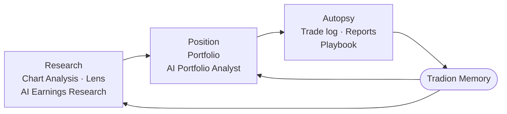

Tradion has a lot of screens. They're easier to hold in your head once you see that they're three stations on a single loop, and that the loop is the product.

## In plain English

Three stages, in the order a trade passes through them. You **research** an idea, you take a **position**, and once the trade closes you **autopsy** it. What that last stage produces is fed back into the first, so the tools get more specific to you the longer you use them.

You can enter the loop at any stage. The autopsy stage is the one that makes the others different from a standard chart tool, because it is where Tradion learns anything about you.

## Station 1: Research

You start with a chart or a question about a company. Three tools answer it, and which one you reach for depends only on what you have in hand:

| You have… | Use | It gives you |
| --- | --- | --- |
| A chart on screen | [Lens](/research/lens) | A verdict, price targets, and support and resistance levels |
| A chart image saved | [Chart Analysis](/research/chart-analyzer) | A verdict, an entry price, a stop, a target, and the reasoning behind the score |
| A question about a company's quarter | [AI Earnings Research](/research/ai-earnings-research) | The company's reported financials, the analyst estimates, and management tone, with every figure tied to its source |

**Support** is a price the stock has repeatedly bounced off from below; **resistance** is one it has repeatedly stalled at from beneath. A **stop** is the price where you exit if the trade goes against you.

## Station 2: Position

Once a brokerage is connected, [Portfolio](/portfolio/overview) shows what you hold:

- An **equity curve**, a line chart of what the whole account has been worth over time.
- **Day P&L** and **total P&L**, profit and loss since this morning, and since you bought.
- **Sector allocation**, how your money splits across industries, so you can see if it is concentrated in one.
- A **sparkline** on each holding, a thumbnail price chart, small enough to sit inside a table row.
- Your biggest movers of the day.

The [AI Portfolio Analyst](/portfolio/ai-portfolio-analyst) is a chat window sitting on top of that data. Because it reads your real positions rather than guessing, you can ask concrete things (*"how concentrated am I in tech?"*, or *"what happens to my portfolio if interest rates move half a percentage point?"*) and get numbers that reconcile with your broker statement.

## Station 3: Autopsy

The trade is closed, so the outcome is known. That makes it the only point in the loop where you can check your decision against a result instead of a forecast.

Log the trade manually or let it import automatically from your broker, then run an autopsy. You get:

- **Root-cause analysis**, what drove the result.
- A **0–100 scorecard** across entry quality, exit discipline, and risk management.
- A **blame breakdown**, how much of the outcome came from your decisions and how much from the market moving, listed share by share.
- A **counterfactual**, the same trade replayed with one thing changed, such as the stop honoured or half the size, so you can see what your own stated rules would have returned.

Repeat findings become **patterns**, each with a severity score, a count of how often it has happened, and what it has cost. Patterns you decide to fix become **playbook rules**, and playbook rules go into a checklist you read before your next entry. Tradion assembles it; running it is yours. It never sits between you and an order.

## The centre: Memory

Every station writes to [Tradion Memory](/concepts/tradion-memory), and every station reads from it. A chart analysis in month three is not the analysis you would have got in week one, because by then Tradion knows you cut winners early on this ticker, that your win rate drops after 2pm, and that "high conviction" in your journal has gone with your worst outcomes.

<Tip>
  **If you only do one thing:** close the loop on ten trades. Ten autopsies is roughly where the behavioural analysis stops being generic and starts being specific to you.
</Tip>

## Where each screen lives

The sidebar is grouped by loop station, so the menu and the mental model are the same thing:

| Sidebar group | Screens | Loop station |
| --- | --- | --- |
| Home | Home | Launchpad |
| Top of the sidebar | AI Portfolio Analyst | Position |
| My Trading | Portfolio, Trade Autopsy, Profile | Position + Autopsy |
| Research | AI Earnings Research, Chart Analysis, Lens | Research |

## Where to start

<CardGroup cols={2}>
  <Card title="Take the tour" icon="compass" href="/get-started/tour">
    Every screen in the sidebar, one paragraph each, in the order you meet them.
  </Card>
  <Card title="Chart Analysis" icon="chart-line" href="/research/chart-analyzer">
    Station 1, end to end: drop in a chart and read what comes back.
  </Card>
  <Card title="Reading a verdict" icon="gauge" href="/concepts/reading-a-verdict">
    What BUY at 72% confidence means, and what it does not.
  </Card>
  <Card title="Tradion Memory" icon="brain" href="/concepts/tradion-memory">
    The centre of the loop: what it stores and how to switch it off.
  </Card>
</CardGroup>
