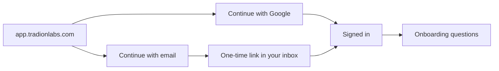

Tradion has no password. You get in with a Google account or with a one-time link sent to your email. Signing up and signing in are the same action — if there's no account on that address, one is created the first time you arrive.

## In plain English

A **magic link** is a one-time sign-in link emailed to you. Clicking it proves you control that inbox, which is the same thing a password is meant to prove — so the password is not needed. The link expires in 15 minutes and stops working after one use, which is why an old one in your inbox will not let you back in.

## The two ways in

<Tabs>
  <Tab title="Google">
    <Steps>
      <Step title="Click Continue with Google">
        The button sits at the top of the sign-in card.
      </Step>
      <Step title="Pick the Google account you want to use">
        Tradion reads only your email address, your name, and your profile picture. It cannot see your Gmail, your Drive, or anything else.
      </Step>
      <Step title="You're in">
        No email round-trip, no waiting.
      </Step>
    </Steps>
  </Tab>
  <Tab title="Magic link">
    <Steps>
      <Step title="Type your email and click Continue with email">
        The screen changes to **Check your email**. If you mistyped the address, click **Use a different email** and start again.
      </Step>
      <Step title="Open the email and click the link">
        The link is valid for **15 minutes** and works **once**. Clicking it a second time fails by design.
      </Step>
      <Step title="Tradion verifies and signs you in">
        You land back in the app while a short "Signing you in" screen finishes.
      </Step>
    </Steps>
  </Tab>
</Tabs>

## Why there's no password

Passwords get reused across sites, leak in other companies' breaches, and get typed into convincing fake login pages. Removing them removes that whole category of problem: there is nothing on your Tradion account for someone to guess, phish, or find in a dump.

Once you're signed in, a session cookie keeps you signed in on that browser for **7 days**. After that, sign in again the same way.

## Switching between the two methods

Your account is identified by your **email address**, not by the method you used to create it. Sign up with Google today, request a magic link to the same address in six months, and you land in the same account with the same history and subscription. It works in reverse too.

<Warning>
  A different email address is a different account, with its own trade history, its own trader profile, and its own subscription. If you use one address for Google and another for email links, you will end up with two accounts that share nothing.
</Warning>

## When it goes wrong

<AccordionGroup>
  <Accordion title="The link says it's invalid, expired, or already used" icon="clock">
    Links last 15 minutes and work once. Two causes beyond timing: you clicked an older link from a previous request (only the newest works), or a corporate mail scanner opened the link before you did and spent it. Request a fresh one and open it straight away.
  </Accordion>
  <Accordion title="I opened the link and ended up signed in somewhere odd" icon="browser">
    The link signs you in wherever it is opened, and many mail apps open links in their own built-in browser window — so you end up signed in there rather than in the browser you started from. Copy the link and paste it into your normal desktop browser instead.
  </Accordion>
  <Accordion title="No email arrived" icon="envelope">
    Check spam and, in Gmail, the Promotions tab. The app shows the same confirmation screen whether or not an account exists — that's deliberate, so nobody can use the form to test which addresses are registered. Delivery is normally under a minute; if two attempts produce nothing, write to [contact@tradionlabs.com](mailto:contact@tradionlabs.com).
  </Accordion>
  <Accordion title="The Google button doesn't appear" icon="ban">
    The button is rendered by a script loaded from Google. Ad blockers, strict tracking protection, and some corporate networks block it, leaving a blank space where the button should be. Use the email link instead — it needs no third-party script.
  </Accordion>
  <Accordion title="Sign-in says the account is scheduled for deletion" icon="trash">
    Deleted accounts sit in a 30-day window before they are erased. See [Deleting your account](/account/deleting-your-account) for how to stop that.
  </Accordion>
</AccordionGroup>

<Info>
  Tradion needs a desktop or laptop browser. The charts, the research canvas, and the automation builder all need the screen width, so phone-sized windows are blocked.
</Info>

## Next

<CardGroup cols={2}>
  <Card title="The onboarding questions" icon="clipboard-list" href="/get-started/onboarding">
    Five questions, about 30 seconds, and they shape every AI answer you get afterwards.
  </Card>
  <Card title="Choosing a plan" icon="credit-card" href="/get-started/choosing-a-plan">
    One question decides which plan you want.
  </Card>
</CardGroup>
