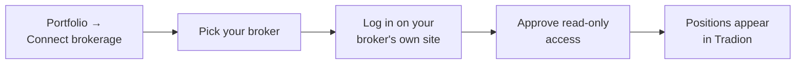

Tradion connects to 30+ brokerages through **SnapTrade**, a regulated aggregator. The connection is **read-only**. Tradion can see your positions and past trades, and cannot place, modify, or cancel an order.

## What connecting unlocks

<CardGroup cols={2}>
  <Card title="Live portfolio dashboard" icon="chart-pie">
    Your account value drawn day by day, profit and loss for today and since you bought, and your money split by industry.
  </Card>
  <Card title="AI Asset Manager" icon="comments">
    Portfolio chat grounded in your real positions instead of hypotheticals.
  </Card>
  <Card title="Automatic trade import" icon="download">
    Closed trades flow into Trade Autopsy without manual entry.
  </Card>
  <Card title="Better behavioural analysis" icon="brain">
    Real fills, sizes, and hold times beat self-reported ones every time.
  </Card>
</CardGroup>

The words on that dashboard, in plain English:

- **Equity curve**, the line of your total account value over time.
- **Day P&L** and **Total P&L**, P&L is profit and loss. Day is what today did to a position; Total is where it stands against what you paid for it.
- **Sector allocation**, what share of your money sits in each industry: technology, healthcare, energy, and so on.
- **Sparkline**, the small line beside each holding showing its price shape over the last ten trading days. No axes, no labels; direction only.

## Connect

<Steps>
  <Step title="Open Portfolio → Connect brokerage">
    Also available from **Settings → Brokerage sync**.
  </Step>
  <Step title="Find your broker">
    Search the list. Supported names include Interactive Brokers, Alpaca, Robinhood, Charles Schwab, E*TRADE, Fidelity, Webull, Tradier, and Coinbase.
  </Step>
  <Step title="Log in on your broker's site">
    The login form is served by your broker, not by Tradion. Your credentials never touch Tradion's servers.
  </Step>
  <Step title="Approve read-only access">
    Confirm the scope. Some brokers add a **2FA** challenge here, two-factor authentication, the second code from your phone or authenticator app.
  </Step>
  <Step title="Wait for the first sync">
    Positions usually appear within 30 seconds. Full trade history can take a few minutes on accounts with a long record.
  </Step>
</Steps>

<Check>
  Connected accounts appear under **Portfolio → Account breakdown**. You can link several brokerages and Tradion will aggregate them.
</Check>

## Security

<AccordionGroup>
  <Accordion title="Can Tradion place trades?" icon="lock">
    No. The connection is read-only at the aggregator level. There is no order-entry code path in Tradion at all.
  </Accordion>
  <Accordion title="Does Tradion store my broker password?" icon="key">
    No. You sign in directly with your broker. Tradion holds only an **access token**, a revocable key that grants read access without carrying your password. SnapTrade issues it, Tradion keeps it on its own servers, and it is never sent to your browser.
  </Accordion>
  <Accordion title="How do I revoke access?" icon="ban">
    **Settings → Brokerage sync → Disconnect**, which removes the connection and its cached data. You can additionally revoke the authorisation from inside your broker's own security settings.
  </Accordion>
  <Accordion title="What data is pulled?" icon="database">
    Account balances, positions, and transaction history. Not your personal details, not your bank links, not your tax documents.
  </Accordion>
</AccordionGroup>

## When it goes wrong

The full diagnostic steps for all of these live on one page, [troubleshooting](/help/troubleshooting). The short version:

| Symptom | First thing to try |
| --- | --- |
| The connection window opens blank | Allow pop-ups for `app.tradionlabs.com` and turn off strict tracking protection for the tab. Safari's "Prevent cross-site tracking" is the usual cause |
| Positions are missing or stale | Press **Sync** on the Portfolio page, then wait a few minutes before trying again, brokers rate-limit repeat calls |
| A "connection broken" banner | **Settings → Brokerage sync → Reconnect**. Your imported history is preserved |
| Your broker isn't in the list | Log trades by hand for now, and [tell us which broker](/help/contact) |
| Numbers differ from your broker statement | Extended-hours pricing and currency conversion cover most of it, see [reading the dashboard](/portfolio/reading-the-dashboard) |

## Prefer not to connect?

Everything behavioural still works. You enter trades by hand instead. You can describe a trade in plain English, or upload a screenshot or PDF of a broker confirmation, and Tradion pulls out the structured fields for you.

<CardGroup cols={2}>
  <Card title="Read the dashboard" icon="table-cells" href="/portfolio/reading-the-dashboard">
    Every panel and number on the Portfolio page, explained.
  </Card>
  <Card title="Log a trade by hand" icon="pen-to-square" href="/trade-intelligence/logging-a-trade">
    The route for anyone without a supported broker.
  </Card>
  <Card title="Troubleshooting" icon="wrench" href="/help/troubleshooting">
    Full steps for connection, sync, and stale-position problems.
  </Card>
  <Card title="Account settings" icon="gear" href="/account/settings">
    Where to sync, reconnect, or disconnect a brokerage later.
  </Card>
</CardGroup>
