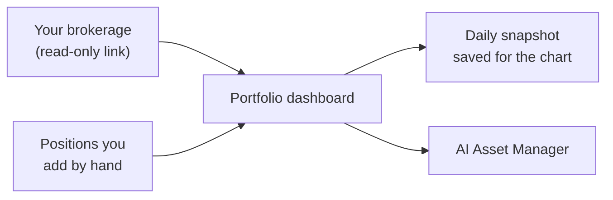

Portfolio is the screen that answers "what do I own, and how is it doing". It pulls positions from your linked brokerages, prices them against live market data, and keeps a daily record so you can see the shape of your account over time.

## What you need first

A connected brokerage. Tradion links to 30+ brokers through SnapTrade, and the link is **read-only**, Tradion reads your positions and past trades, and has no way to place, change, or cancel an order. See [Connecting a brokerage](/portfolio/connect-brokerage).

Positions usually appear within about 30 seconds of authorising the connection.

## What it shows at a glance

<CardGroup cols={2}>
  <Card title="Net worth over time" icon="chart-line">
    Your **equity curve** (total account value drawn day by day) with 1W / 1M / 3M / 1Y / All range buttons.
  </Card>
  <Card title="Day and total P&L" icon="arrow-trend-up">
    **P&L** is profit and loss. Day is what today did to a position; total is where it stands against what you paid. Both in currency and percent.
  </Card>
  <Card title="Allocation and exposure" icon="chart-pie">
    **Sector allocation** (your money split by industry) plus a **diversification score** rating how evenly it is spread, and your largest position.
  </Card>
  <Card title="Holdings and movers" icon="table-list">
    Every position with a **sparkline** (a small ten-day price trend line) sortable, plus the five biggest movers today.
  </Card>
</CardGroup>

Each panel is explained line by line in [Reading the dashboard](/portfolio/reading-the-dashboard).

## No broker? Build the portfolio by hand

Open the **Manage Positions** tab and add a position with three fields: ticker, number of shares, and average cost, the price you paid per share, averaged across your buys. Tradion prices it live from there.

Hand-entered positions drive the same charts, allocation, and AI Asset Manager context that broker positions do. What you give up is automatic trade import, so closed trades have to be logged yourself, see [Logging a trade](/trade-intelligence/logging-a-trade).

You cannot add a manual position for a ticker a connected broker already reports. Tradion blocks it so the same holding is never counted twice.

## Several brokerages, one view

Link as many brokers as you use. The dashboard adds them together into a single net worth figure and one holdings table, with the same ticker held in two accounts merged into one row. The **Account breakdown** panel keeps the per-account detail: broker, account type, value, cash, and when it last synced.

## Syncing and refresh

<Steps>
  <Step title="On page load">
    Tradion reads what it already has, priced against current market data. Results are cached for 30 seconds so a fast reload doesn't hammer your broker.
  </Step>
  <Step title="When you press Sync">
    Tradion re-pulls balances and positions from every active connection, imports closed trades, and clears the cache. Brokers rate-limit these calls, so leave a few minutes between syncs.
  </Step>
  <Step title="One snapshot per day you visit">
    Opening the page records a single snapshot of your total value for that calendar day. Those snapshots are the only thing the net worth chart draws.
  </Step>
</Steps>

<Warning>
  There is no backfill and no background job. A day you never open Portfolio is a day with no snapshot, and the chart shows a gap. The chart is also empty on day one, because one point is not a line.
</Warning>

<Note>
  The page does not poll in the background. If you leave it open through the session, refresh or press **Sync** to see current numbers.
</Note>

<CardGroup cols={2}>
  <Card title="Connect a brokerage" icon="link" href="/portfolio/connect-brokerage">
    The read-only link, what it pulls, and how to revoke it.
  </Card>
  <Card title="Read the dashboard" icon="table-cells" href="/portfolio/reading-the-dashboard">
    Every panel and number, explained.
  </Card>
</CardGroup>
