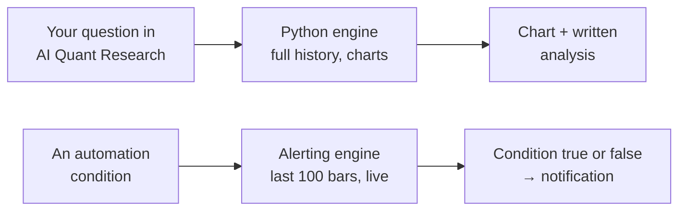

A **technical indicator** is a number calculated from price and volume history, an average, a ratio, a score. It does not predict anything on its own. It compresses a lot of bars into one figure you can compare or set a rule against.

This page lists every indicator Tradion computes, what each one tells you, and which of the two places it works in.

<Info>
  Both places are **Trader** and above. See [plan comparison](/reference/plan-comparison).
</Info>

## The two places indicators run

Tradion computes indicators twice, in two different engines, for two different jobs.

| | AI Quant Research | Automation conditions |
| --- | --- | --- |
| What it produces | A chart and a written read | True or false, every cycle |
| History used | Years, whatever the question needs | The last 100 bars |
| How fresh | Fetched when you ask | Recomputed on a five-minute cache |
| Candlestick patterns | No | Yes, 31 of them |

The **Where** column in every table below reads **Both**, **Quant research**, or **Automations**.

<Note>
  An automation condition needs at least 20 bars of history, and at least `period + 5` bars for the specific indicator, before it produces a value. A newly listed ticker on a slow timeframe can sit silent until enough bars exist. The automation shows "no data available" rather than firing.
</Note>

## Trend

Trend indicators answer one question: which way has price been drifting, and how firmly. Most of them are a **moving average**, the average price over the last N bars, recalculated on every new bar, which smooths out the noise so the direction is visible.

| Indicator | Code | What it tells you | Parameters | Where |
| --- | --- | --- | --- | --- |
| Simple Moving Average | `SMA` | The plain average close over the last N bars, the middle of recent price action, and whether price is above or below it | `period` | Both |
| Exponential Moving Average | `EMA` | The same average, but recent bars count for more, so it turns sooner than an SMA of the same length | `period` | Both |
| Weighted Moving Average | `WMA` | An average that weights each bar by how recent it is, in a straight line from oldest to newest | `period` | Both |
| Hull Moving Average | `HMA` | A moving average built to turn quickly without the jumpiness you get from shortening an EMA | `period` | Both |
| Triangular Moving Average | `TRIMA` | An average of an average, the smoothest of the moving averages, and the slowest to change its mind | `period` | Both |
| Kaufman Adaptive MA | `KAMA` | A moving average that speeds up when price is trending and slows down when it is chopping sideways | `period` | Both |
| Double EMA | `DEMA` | An EMA with most of its lag mathematically removed, so it sits closer to current price | `period` | Both |
| Triple EMA | `TEMA` | The same trick applied a third time, faster than DEMA, and noisier for it | `period` | Both |
| Zero-Lag MA | `ZLMA` | An EMA that compensates for its own lag by projecting recent movement forward | `period` | Both |
| T3 (Tillson) | `T3` | A heavily smoothed exponential average that still reacts sooner than a plain EMA of the same length | `period` | Quant research |
| Parabolic SAR | `SAR` / `PSAR` | A dot that trails price and flips to the other side when the trend reverses, commonly read as a trailing stop level | `step` (0.02), `max` (0.2) | Both |
| SuperTrend | `SUPERTREND` | A line placed a set number of average bar-ranges away from the middle of the bar; price closing through it marks a trend flip | `period`, `multiplier` (3) | Both |
| Ichimoku conversion line | `ICHIMOKU` | The midpoint of the highest high and lowest low of the last 9 bars, the fast line of the Ichimoku system | `conversionPeriod` (9), `basePeriod` (26), `spanPeriod` (52) | Automations |
| Chandelier Exit | `CHANDELIER` | A trailing stop hung a set number of average bar-ranges below the highest high of the last 22 bars | `multiplier` (3) | Automations |
| Aroon Up | `AROON_UP` | How recently the highest high in the window happened, as 0–100. 100 means the high was the most recent bar | `period` | Both |
| Aroon Down | `AROON_DOWN` | The same for the lowest low | `period` | Both |
| Aroon Oscillator | `AROON_OSC` | Aroon Up minus Aroon Down, positive when the recent highs are fresher than the recent lows. An **oscillator** is any indicator that moves inside a fixed range, so an extreme reading means the same thing on any ticker | `period` | Both |
| Midpoint | `MIDPOINT` | The middle of the highest and lowest close over N bars | `period` | Quant research |
| Midprice | `MIDPRICE` | The middle of the highest high and the lowest low over N bars | `period` | Quant research |
| Median price | `MEDIAN_PRICE` | The middle of the current bar's high and low |, | Automations |
| Typical price | `TYPICAL_PRICE` | High, low, and close of the current bar, averaged |, | Automations |
| Weighted close | `WEIGHTED_CLOSE` | The same average with the close counted twice, so it leans toward where the bar finished |, | Automations |

<Tip>
  In quant research, `AROON` returns up, down, and oscillator together in one call. In automations you pick one of the three as your condition.
</Tip>

## Momentum

Momentum indicators measure how hard price has been pushed and whether that push is fading. Most are **oscillators**, indicators that move inside a fixed range, so an extreme reading means the same thing regardless of the ticker's price.

| Indicator | Code | What it tells you | Parameters | Where |
| --- | --- | --- | --- | --- |
| Relative Strength Index | `RSI` | A 0–100 score of how much of the recent move has been up rather than down. Under 30 it has been sold hard, over 70 bought hard, conventions that break in a strong trend | `period` | Both |
| Stochastic | `STOCH` | Where the close sits inside the high–low range of the last N bars, as 0–100. Near 100 means it closed at the top of its recent range | `kPeriod` (14), `dPeriod` (3) | Both |
| Stochastic RSI | `STOCHRSI` | The same range position applied to RSI instead of price, moves faster and reaches extremes more often | `period` | Both |
| MACD | `MACD` | The gap between a fast average and a slow average. Positive means short-term momentum is running ahead of long-term | `fast` (12), `slow` (26), `signal` (9) | Both |
| Average Directional Index | `ADX` | How strong the trend is, 0–100, with no opinion on direction. Under 20 usually means there is no trend to trade | `period` | Both |
| Commodity Channel Index | `CCI` | How far price has strayed from its own recent average, measured in units of its usual wander | `period` | Both |
| Rate of Change | `ROC` | The percentage price change over the last N bars | `period` | Both |
| Momentum | `MOM` | The raw price change over the last N bars, in currency rather than percent | `period` | Both |
| Williams %R | `WILLR` | Where the close sits in the recent range, written as −100 to 0. A mirror of Stochastic | `period` | Both |
| Balance of Power | `BOP` | Where the bar closed relative to where it opened, scaled by the bar's range. +1 means buyers took it wall to wall |, | Both |
| Chande Momentum Oscillator | `CMO` | The balance of total up-moves against total down-moves over N bars, −100 to +100 | `period` | Both |
| Absolute Price Oscillator | `APO` | The gap between a 12-bar and a 26-bar EMA, in price units |, | Both |
| Percentage Price Oscillator | `PPO` | The same gap expressed as a percentage, so a low-priced stock and a high-priced one become comparable |, | Both |
| Know Sure Thing | `KST` | Four rate-of-change readings over four different lookbacks, smoothed and added together |, | Both |
| True Strength Index | `TSI` | Momentum smoothed twice, slower and cleaner than RSI, with fewer false turns | `fast`, `slow` | Both |
| Ultimate Oscillator | `UO` | Momentum blended across 7, 14, and 28 bars so no single lookback dominates the reading |, | Both |
| Awesome Oscillator | `AO` | The difference between a 5-bar and a 34-bar average of each bar's midpoint |, | Both |
| Fisher Transform | `FISHER` | Price position in the recent range, stretched mathematically so extremes stand out sharply | `period` | Both |
| TRIX | `TRIX` | The percentage rate of change of a triple-smoothed EMA, short-term noise removed before momentum is measured | `period` | Automations |
| Coppock Curve | `COPPOCK` | Long-horizon momentum, originally built to spot the end of major declines |, | Automations |
| Detrended Price Oscillator | `DPO` | Price with the longer trend subtracted out, so the shorter cycle underneath is visible | `period` | Automations |
| Elder Bull Power | `BULL_POWER` | How far the bar's high reached above a 13-bar EMA (how much buyers extended the bar |) | Automations |
| Elder Bear Power | `BEAR_POWER` | How far the bar's low reached below that same EMA |, | Automations |
| Squeeze Momentum | `SQZMI` | Flags when the Bollinger Bands have contracted inside the Keltner Channels (a sign volatility has compressed and may expand |) | Quant research |

## Volatility

**Volatility** is how much price moves around, not which way. These indicators size the movement so you can scale a stop or spot a market that has gone quiet.

| Indicator | Code | What it tells you | Parameters | Where |
| --- | --- | --- | --- | --- |
| Average True Range | `ATR` | The average distance from a bar's high to its low over N bars, in currency, the size of a normal bar for this ticker right now | `period` | Both |
| Normalized ATR | `NATR` | The same figure as a percentage of price, so a normal bar in NVDA and a normal bar in a penny-priced ticker become comparable | `period` | Both |
| True Range | `TR` | The size of the most recent bar alone, including any gap from the previous close |, | Both |
| Bollinger Bands | `BBANDS` | A moving average with a band above and below at a set number of standard deviations. **Standard deviation** is a measure of how spread out recent prices have been, so the bands widen when the market gets jumpy | `period`, `stdDev` (2) | Both |
| Bollinger %B | `PERCENT_B` | Where price sits between the two bands. 0 is on the lower band, 1 is on the upper, above 1 is outside | `period`, `stdDev` (2) | Automations |
| Bollinger Bandwidth | `BANDWIDTH` | How far apart the bands are, as a percentage of the middle band. A low reading means the market has gone quiet | `period`, `stdDev` (2) | Automations |
| Keltner Channels | `KC` | A channel drawn a multiple of ATR either side of a moving average, a smoother alternative to Bollinger Bands | `period`, `multiplier` (1.5) | Both |
| Donchian Channels | `DC` | The highest high and lowest low of the last N bars, the literal edges of the recent range | `period` | Both |
| Standard deviation | `SD` / `STDDEV` | How widely closing prices have scattered around their own average over N bars | `period` | Automations |
| Choppiness Index | `CHOP` | A 0–100 score of whether the market is trending or grinding sideways. High means choppy | `period` | Automations |
| Ulcer Index | `UI` / `ULCER_INDEX` | How deep and how long the **drawdowns** have been, a drawdown is the fall from a recent high to the low that follows it. Higher means a rougher ride | `period` | Both |
| Mass Index | `MASS_INDEX` | Watches the high-to-low range widening over a run of bars, used to anticipate a reversal |, | Automations |

## Volume

**Volume** is the number of shares or contracts traded in a bar. Volume indicators combine it with price to ask whether a move had real participation behind it.

| Indicator | Code | What it tells you | Parameters | Where |
| --- | --- | --- | --- | --- |
| On-Balance Volume | `OBV` | A running total that adds the bar's volume when price closes up and subtracts it when price closes down |, | Both |
| Accumulation/Distribution Line | `ADL` | A running total weighted by where in its range each bar closed (closing near the high adds more |) | Both |
| Chaikin A/D Oscillator | `ADOSC` | The gap between a fast and a slow average of the A/D line, so you can see it turning | `fast`, `slow` | Quant research |
| Chaikin Money Flow | `CMF` | That same close-position weighting averaged over N bars, −1 to +1. Positive means bars have been closing in the upper half on volume | `period` | Both |
| Elder Force Index | `EFI` | The size of the price change multiplied by the volume behind it, move and participation in one number | `period` | Both |
| Money Flow Index | `MFI` | RSI computed on price times volume, so heavy-volume moves count for more. 0–100 | `period` | Both |
| Ease of Movement | `EOM` | How much volume it took to move price a given distance. High means price moved on little effort | `period` | Quant research |
| Negative Volume Index | `NVI` | Tracks price only on bars where volume fell against the previous bar |, | Quant research |
| Positive Volume Index | `PVI` | Tracks price only on bars where volume rose |, | Quant research |
| Price Volume Trend | `PVT` | A running total of each bar's percentage price change multiplied by its volume |, | Both |
| VWAP | `VWAP` | The average price paid across the session, weighted by volume (the common intraday reference for whether you got a good fill |) | Automations · quant research (see note) |

<Note>
  In AI Quant Research, VWAP arrives as a `vwap` column on the bar data from the market-data provider rather than through the indicator router. You can chart it and compare against it, but you do not compute it.
</Note>

<Warning>
  **Volume indicators need real volume.** Forex has no central exchange, so there is no consolidated volume figure, forex bars carry zero volume, and volume indicators computed on them are meaningless. Automations do not offer indicator conditions on forex at all. In quant research, treat any volume indicator on a forex pair as unusable.
</Warning>

## Candlestick patterns

A **candlestick pattern** is a named shape formed by one to three bars, the relationship between each bar's open, close, high, and low. These are available **in automation conditions only**, and each returns `1` when the pattern is detected on the most recent bar and `0` when it is not.

<AccordionGroup>
  <Accordion title="Bullish patterns, 15" icon="arrow-trend-up">
    | Code | The shape |
    | --- | --- |
    | `BULLISH_ENGULFING` | A green bar whose body completely covers the previous red bar's body |
    | `BULLISH_HARAMI` | A small green bar sitting entirely inside the previous large red bar's body |
    | `BULLISH_HARAMI_CROSS` | The same, where the inside bar is a doji, an open and close at almost the same price |
    | `BULLISH_HAMMER` | A green bar with a long lower wick and a small body near the top |
    | `BULLISH_INVERTED_HAMMER` | A green bar with a long upper wick and a small body near the bottom |
    | `BULLISH_MARUBOZU` | A green bar with almost no wicks. It opened at the low and closed at the high |
    | `BULLISH_SPINNING_TOP` | A green bar with a small body and long wicks both sides, showing indecision |
    | `HAMMER` | The hammer shape without the colour requirement |
    | `MORNING_STAR` | Three bars: a big red, a small indecisive one, then a big green closing well up |
    | `MORNING_DOJI_STAR` | The same with a doji as the middle bar |
    | `THREE_WHITE_SOLDIERS` | Three consecutive strong green bars, each closing above the last |
    | `PIERCING_LINE` | A red bar followed by a green bar that closes above the midpoint of the red one |
    | `TWEEZER_BOTTOM` | Two bars with matching lows, suggesting a floor was tested twice |
    | `DRAGONFLY_DOJI` | Open, close, and high at nearly the same price with a long lower wick |
    | `ABANDONED_BABY` | A doji that gaps away from the bars on both sides of it |
  </Accordion>
  <Accordion title="Bearish patterns, 15" icon="arrow-trend-down">
    | Code | The shape |
    | --- | --- |
    | `BEARISH_ENGULFING` | A red bar whose body completely covers the previous green bar's body |
    | `BEARISH_HARAMI` | A small red bar sitting entirely inside the previous large green bar's body |
    | `BEARISH_HARAMI_CROSS` | The same, where the inside bar is a doji |
    | `BEARISH_HAMMER` | A red bar with a long lower wick and a small body near the top |
    | `BEARISH_INVERTED_HAMMER` | A red bar with a long upper wick and a small body near the bottom |
    | `BEARISH_MARUBOZU` | A red bar with almost no wicks. It opened at the high and closed at the low |
    | `BEARISH_SPINNING_TOP` | A red bar with a small body and long wicks both sides |
    | `HANGING_MAN` | A hammer shape appearing after an advance rather than a decline |
    | `EVENING_STAR` | Three bars: a big green, a small indecisive one, then a big red closing well down |
    | `EVENING_DOJI_STAR` | The same with a doji as the middle bar |
    | `THREE_BLACK_CROWS` | Three consecutive strong red bars, each closing below the last |
    | `DARK_CLOUD_COVER` | A green bar followed by a red bar that closes below the midpoint of the green one |
    | `TWEEZER_TOP` | Two bars with matching highs, suggesting a ceiling was tested twice |
    | `GRAVESTONE_DOJI` | Open, close, and low at nearly the same price with a long upper wick |
    | `SHOOTING_STAR` | A small body at the bottom with a long upper wick, after an advance |
  </Accordion>
  <Accordion title="Neutral, 1" icon="minus">
    | Code | The shape |
    | --- | --- |
    | `DOJI` | Open and close at almost the same price, the bar moved and came back, with no side winning |
  </Accordion>
</AccordionGroup>

<Warning>
  A detected pattern is a shape, not a verdict. `BULLISH_ENGULFING` firing means the last two bars had that geometry. Nothing more. Pattern conditions fire often on short timeframes. Pair one with a second condition, or expect a busy inbox.
</Warning>

## Parameters, in plain English

Most indicators take a `period`, the number of bars the calculation looks back over. In automation conditions the period defaults to **14** unless the indicator has its own convention baked in, and you can change it in the condition setup.

The other parameters that appear above:

| Parameter | What it changes |
| --- | --- |
| `period` | How many bars the calculation reads. Larger is smoother and slower to react |
| `fast` / `slow` / `signal` | The three lengths inside MACD-style indicators, the quick average, the slow one, and the line that smooths their difference |
| `stdDev` | How wide the Bollinger Bands sit. 2 is the convention; 1 makes them tighter and touched more often |
| `multiplier` | How far a channel or trailing stop sits from its centre line, in ATR units |
| `kPeriod` / `dPeriod` | The lookback and the smoothing length for Stochastic |
| `step` / `max` | How fast Parabolic SAR accelerates toward price, and its ceiling |
| `conversionPeriod` / `basePeriod` / `spanPeriod` | The three Ichimoku lookbacks |

### What this actually means

Changing `period` is not tuning. It changes the question. RSI(2) asks whether the last two bars were extreme. RSI(14) asks whether the last three weeks were. The same threshold means completely different things at each. Pick the period that matches the horizon you trade, then leave it alone.

## Where you can use them

| | AI Quant Research | Automation conditions |
| --- | :---: | :---: |
| Trend and momentum | ✅ | ✅ |
| Volatility | ✅ | ✅ |
| Volume | ✅ | ✅ |
| Candlestick patterns | ❌ | ✅ |
| Forecasting, options greeks, backtests | ✅ | ❌ |

By asset type, indicator conditions in automations run on **stocks, ETFs, and crypto pairs only**. Forex and single options contracts do not take indicator conditions. The full breakdown is on [supported assets](/reference/supported-assets).

In automations, an indicator condition offers five operators: *Goes Above (continuous)*, *Goes Below (continuous)*, *Crosses Above (one-shot)*, *Crosses Below (one-shot)*, and *Equals (exact)*. Those are the labels on screen. The choice controls how often you get alerted, see [operators](/automations/operators).

<CardGroup cols={2}>
  <Card title="Signal types" icon="signal" href="/automations/signal-types">
    How an indicator becomes a condition, and what else can trigger an automation.
  </Card>
  <Card title="Supported assets" icon="coins" href="/reference/supported-assets">
    Which asset types accept which indicators and signals.
  </Card>
  <Card title="AI Quant Research" icon="flask" href="/research/quant-research">
    Ask for any of these in plain English and get the chart with it.
  </Card>
  <Card title="Glossary" icon="book-open" href="/help/glossary">
    Every trading term the app uses, defined once.
  </Card>
</CardGroup>
