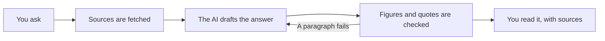

Every figure in an [AI Earnings Research](/research/ai-earnings-research) answer comes from a source you can open. This page covers what those sources are, how the answer is checked against them, and where the checking stops.

<Info>
  AI Earnings Research is included on **Trader** and **Quant**. See the [plan comparison](/reference/plan-comparison).
</Info>

## What it reads

| Source | What it holds | Where it comes from |
| --- | --- | --- |
| **SEC financials** | Revenue, net income, operating income, cash flow, capital spending, stock compensation and diluted earnings per share, quarter by quarter | The company's filings with the SEC |
| **Transcript** | The passages of the earnings call, tied to who said them | A licensed earnings data provider |
| **Consensus** | Analyst estimates for the reported and the upcoming quarter | The same kind of provider |
| **Prices** | Daily closing prices | A market data feed |
| **Filing risks** | The risk section of a company's filing | The company's filings with the SEC |

**Consensus** is the average of what the analysts covering a stock predicted. It is a snapshot from the moment Tradion fetched it, and estimates change, so every source shows its retrieval date.

<Frame caption="Open View Source under an answer. Each reported value shows the filing it came from and the exact data label the company used.">
  
</Frame>

## How an answer is checked

The AI writes the sentences. It does not type the numbers. Each figure is a reference to a value Tradion already holds, and the number is filled in from that value. Charts are drawn from the same values, with the unit and period on the axis.

Two things are checked before you see a paragraph:

- **Every figure must map to a source.** One that cannot is not shown.
- **Every quote must match the transcript.** A paraphrase inside quotation marks fails.

A paragraph that fails is sent back to the AI to rewrite. That rewrite is why some answers take noticeably longer than others.

### In plain English

The AI is good at reading and explaining. It is not trusted to remember a number. So the numbers come from data, and the AI's job is to say what they mean.

<Warning>
  The checking covers the **answer**. It does not cover the **working notes** shown while the answer is prepared, which are an automatic summary of the AI's thinking and can contain a wrong figure.
</Warning>

## Beat and miss

A company **beats** when its reported result comes in above the consensus estimate and **misses** when it comes in below. Neither says the business is good or bad. It says the business surprised the people paid to predict it.

Tradion does not work out a beat or miss itself, because the two numbers are measured differently. The provider scores its own headline earnings per share against its own estimate. The figure in a filing follows **GAAP** (US Generally Accepted Accounting Principles), the standard rules filings follow. Subtracting one from the other can report a beat that never happened.

Instead, for a quarter the provider has already scored, Tradion shows the provider's own numbers, labelled as the provider's:

- **Provider EPS**, its headline earnings per share
- **EPS Surprise**, its EPS minus its estimate
- **Revenue Surprise**, its revenue minus its estimate

<Frame caption="The consensus source inside View Source. The scheduled quarter has an estimate but no result yet, so its provider columns are empty.">
  
</Frame>

The **Basis** column reads *Unknown* because the provider does not say how it built its estimates. A percentage EPS surprise is never shown. Against an estimate near zero, the percentage is meaningless.

<Note>
  Tradion will not chart the provider's EPS beside a filing's diluted EPS, or an estimate beside a filing's diluted EPS, because the bars would read as a like-for-like gap.
</Note>

## Management tone

When it reads a transcript, the AI scores each speaker from 0 (very cautious) to 100 (very confident) and lists hedging language, the phrases that soften a claim, such as "depending on how things play out".

A speaker who said only a sentence or two, or who only declined to comment, gets a dash rather than a low score. There was too little to read.

<Warning>
  Tone is a model's reading of the call, not a reported figure. Use it to notice where to read the transcript closely, not as a measurement.
</Warning>

## Where the checking stops

- **Estimates are a snapshot.** Check the retrieval date before you rely on one.
- **Filing values can come from a later filing** that repeats an earlier period. The date shown is the filing's, not always the original announcement.
- **A missing transcript** means the tone and call quotes are missing, and the answer says so.

<CardGroup cols={2}>
  <Card title="AI Earnings Research" icon="magnifying-glass-chart" href="/research/ai-earnings-research">
    Asking a question, the four views, and what counts as a message.
  </Card>
  <Card title="Data sources" icon="database" href="/concepts/data-sources">
    Every provider Tradion reads, and how often each refreshes.
  </Card>
</CardGroup>
