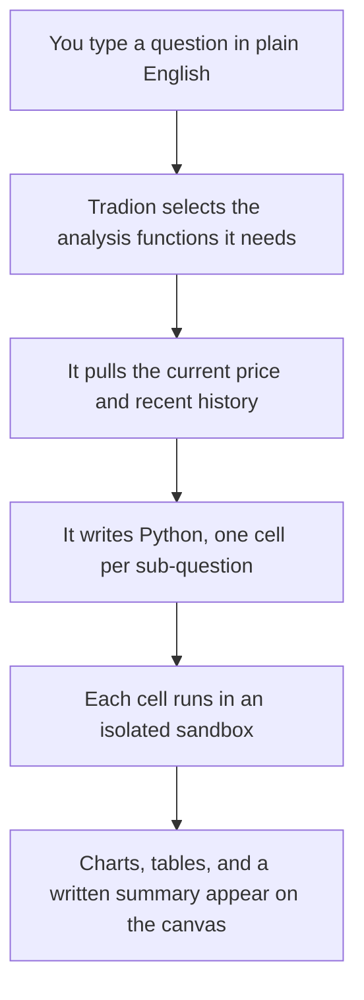

AI Quant Research answers questions about market data by writing and running real Python code on your behalf. You type the question the way you'd say it out loud. You never write a line of code.

<Info>
  AI Quant Research needs the **Trader** plan or above. Starter does not include it. See [plan comparison](/reference/plan-comparison).
</Info>

<Frame caption="A finished analysis. The written answer on the left, the synthesised dashboard on the right, live quote and headlines underneath.">
  
</Frame>

## In plain English: what "quantitative" means

**Quantitative** means counted rather than judged by eye. Quantitative analysis is maths run over price history instead of a squint at a chart.

Eyeballing gives you *"NVDA has been jumpier than AMD lately."* Measuring gives you *"NVDA's daily moves have been about 1.8× the size of AMD's over the past six months, and its worst peak-to-trough fall was 12% deeper."* One is an impression; the other is a number you can act on or argue with. Turning the first into the second is all this tool does.

**You need no maths background and no Python.** Every number comes with a short written explanation beside it. Where a chart says **volatility** (how much a price bounces around, whichever way it goes) or **standard deviation**, the specific measure of how spread out a set of numbers is, the summary underneath says what that means for the ticker in front of you.

## When to reach for it

| What you have in front of you | Use | Why |
| --- | --- | --- |
| A chart open on your screen right now | [Lens](/research/lens) | Reads the screen and returns a verdict in about 20 seconds |
| A chart saved as an image | [Chart Analyzer](/research/chart-analyzer) | Verdict plus entry, stop, and target levels |
| A question that needs numbers across months, or across several tickers at once | **AI Quant Research** | Nothing else measures; it computes the answer |

The rule of thumb: if the answer would fit on one chart, use Lens or Chart Analyzer. If answering it means counting, comparing, or testing something across history, use AI Quant Research.

## The two panels

The terminal is a split screen, and only one half takes input.

**Left, the chat panel.** The narrow column, and the only place you type. Your question, Tradion's reply, and a progress block showing what it's doing right now. After the first analysis a toggle appears: **Analysis** runs fresh work and produces new cells; **Ask** answers questions about results already on screen without running anything.

**Right, the canvas.** Your results, broken into numbered cells, one step each: fetch the data, compute the measure, draw the chart. There is nothing to type into on this side, no editor and no Run button, so everything you want changed you ask for on the left. Two tabs sit above it. **Canvas** shows the cells; **Dashboard** unlocks once every cell finishes and pulls the session into one summary card.

The header also carries **Templates** (the prebuilt workflow library), **News Wire** (current headlines), and **Personalization** (how much the AI leans on what it knows about how you trade).

## How a question becomes running code

You can watch this happen. The progress block counts through eight labelled steps and marks each cell as it completes. Expect one to three minutes for a full analysis, longer if you asked for ten years across five tickers.

Tradion decides how many cells your question needs, roughly three to five for a quick lookup, eight to twelve for a full analysis with charts. There's no cap and no add-cell control.

## Every run uses live market data

Before writing any code, Tradion fetches the current quote for your ticker, last price, day's high and low, volume, change against the previous close. It knows whether the market is open, pre-market, or after hours, and labels the price accordingly. The generated code then pulls its own fresh history when it runs. Nothing comes from a stale cache.

<Note>
  Candlestick charts keep updating after they render, with buttons for 1D, 1W, 1M, 3M, YTD, 1Y, and 5Y. Results from a **backtest** (a run of trading rules over past prices to see what would have happened) stay fixed, as do histograms. A result chart that quietly changed would be misleading.
</Note>

## Indicators, without looking any of them up

An **indicator** is a number worked out from price or volume that's meant to tell you something, RSI, a 0–100 score for how hard a price has been pushed one way lately; a **moving average**, the average closing price over the last N days, redrawn daily; Bollinger Bands, which draw a channel around that average. Tradion computes them across trend, momentum, volatility, volume, options-derived measures, and machine-learning forecasts.

Options-derived measures include **Gamma Exposure (GEX)**, the net gamma position market makers hold at each strike. A large positive GEX level acts like a gravity well: dealer hedging tends to push price back toward it. A negative GEX level means dealers amplify moves instead. The terminal's Options widget visualises the full GEX profile across the strike range.

You don't pick from a list. Ask for *"the usual momentum indicators on AAPL"* and Tradion chooses; name one directly if you'd rather. Full list: [technical indicators reference](/reference/technical-indicators).

## Sessions are saved automatically

There is no Save button. Close the tab mid-analysis and the results are waiting when you come back. The terminal's home screen lists past sessions with the title, the question that started it, and when it ran. Double-click a row to reopen it.

## What one question costs

A **quant session** is one message sent in Analysis mode. Ask mode is free and unlimited.

| Plan | Quant sessions per month |
| --- | --- |
| Starter | Not included |
| Trader | 30 |
| Quant | 300 |

Ask mode reads results that already exist, so nothing re-runs and nothing is charged. Interrogate what you've got there before spending another session on a fresh run.

## Next

<CardGroup cols={2}>
  <Card title="Your first analysis" icon="play" href="/research/your-first-analysis">
    A complete worked example, from blank screen to exported code.
  </Card>
  <Card title="The canvas" icon="table-layout" href="/research/the-canvas">
    What lives inside a cell, and what happens when one fails.
  </Card>
  <Card title="Templates and scenarios" icon="layer-group" href="/research/templates-and-scenarios">
    365 prebuilt workflows so you never face a blank prompt.
  </Card>
  <Card title="Usage limits" icon="gauge" href="/concepts/usage-limits">
    What counts against your allowance, and when it resets.
  </Card>
</CardGroup>
