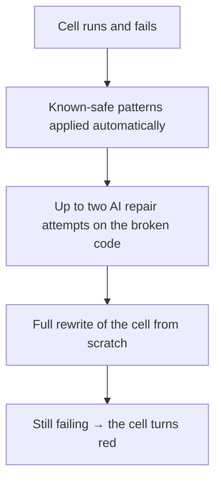

The canvas is the right-hand half of AI Quant Research. It's where your question turns into numbered steps you can read, check, and take away with you.

<Info>
  AI Quant Research needs the **Trader** plan or above. See [plan comparison](/reference/plan-comparison).
</Info>

<Frame caption="Every part of a cell, and what each one is telling you. The Code toggle is the one most people never find.">
  
</Frame>

## In plain English: why the work arrives in pieces

Tradion doesn't hand you one answer. It breaks your question into steps and shows each one separately — fetch the prices, work out the measure, draw the chart, say what it found.

That's deliberate. When an answer arrives as a single paragraph you either believe it or you don't. When it arrives as numbered steps with the code and the numbers attached, you can find the step you disagree with and check it. A wrong cell is visible; a wrong paragraph is not.

## What lives in one cell

A **cell** is one step of the analysis — fetch this data, compute that measure, draw this chart. Each one carries:

| Part | What it shows |
| --- | --- |
| **Number and title** | Its position in the sequence and what it's doing, in words |
| **Status** | `Queued`, then `Running · 4.2s` with a live counter, then `Done · 11.8s` or `Error` |
| **Code / Output toggle** | Flips between the generated Python and the result |
| **Copy button** | Puts that cell's Python on your clipboard |
| **Live Output** | While it runs, whatever the code prints, streaming line by line |
| **AI Insight** | Two or three sentences reading the result, written like a desk note |
| **Charts and tables** | Interactive charts — hover, zoom, reset; tables show the first 100 rows |
| **Console output** | Printed text, collapsed when the cell also drew a chart |

Cells run in order but each fetches its own data, so a failure in cell 4 doesn't poison cells 5 and 6.

Tradion decides how many cells your question needs — roughly three to five for a quick lookup, eight to twelve for a full analysis with charts. There's no cap and no add-cell control. To get an extra step, ask for it in the chat panel and Tradion builds a new analysis that includes it.

## Reading the code

This is the part worth your time. Flip a cell to **Code** and its Python appears with line numbers. The function names say what they do, and there are usually only ten or fifteen lines. Read three or four cells and you start recognising the shape — fetch bars, compute a column, plot it. You don't need to be able to write it.

The code is **read-only inside the canvas**. There is no in-place editor, no Run button, and no way to re-run one cell; execution happens on Tradion's servers, not in your browser. Two routes to change something:

1. **Ask in the chat panel.** *"Do that again with a two-year window and add a 200-day moving average"* — a moving average being the average closing price over the last N days, redrawn daily. Tradion regenerates the analysis with the change. That's a new message in Analysis mode, so it costs a session.
2. **Export the notebook.** The **Export** button above the canvas offers **Code — Jupyter notebook (.ipynb)**, holding every completed cell in order with its output. Open it in Jupyter, VS Code, or Colab and edit freely — starting from code that already works is the fastest way to learn the language.

<Note>
  A **quant session** is one message sent in Analysis mode. Ask mode is free and unlimited. It answers follow-ups about cells already on the canvas without regenerating anything — see [usage limits](/concepts/usage-limits).
</Note>

<Tip>
  Export before you ask a follow-up analysis. Once you confirm **Start new analysis?** the canvas is replaced — the old session is still in your history, but the notebook in your downloads folder is faster to reach.
</Tip>

## When a cell fails

Generated code breaks sometimes. A ticker changed its listing, a data feed hiccupped, a variable ended up empty. Tradion tries to fix it before you ever see a problem, in layers:

The first layer catches routine mistakes with fixed rules, no AI involved. The second reads the error and patches the line that broke — twice at most. The third discards the code and writes the cell again from the original request. All of it is silent: the cell stays in **Running** with output streaming.

If all three fail, the cell turns red with an **Execution Error** panel and the raw error text. Read its last line — it usually names the problem. Common causes:

- **The data doesn't exist.** A delisted ticker, a window longer than the available history, or an options chain on a symbol that has none.
- **The window is too short.** A 200-day moving average needs 200 days of bars.
- **The cell ran too long.** Cells stop after five minutes. Narrow the scope — fewer tickers, or a shorter period.

A red cell doesn't invalidate the rest; the other cells still hold real results.

## The Dashboard view

Two tabs sit above the canvas: **Canvas** and **Dashboard**. Dashboard stays disabled until every cell finishes, then becomes available and, on most runs, opens itself.

It pulls the session into one card — a conviction reading, a time horizon, the thesis, what could go wrong, key risks, key takeaways, suggested next steps. The canvas is the working; the dashboard is the conclusion.

<Warning>
  The dashboard states a view. It does not tell you to trade. Tradion produces analysis; the decision and the risk are yours.
</Warning>

Switch back to **Canvas** at any time, and it switches back on its own the moment a new cell starts running.

## Next

<CardGroup cols={2}>
  <Card title="Templates and scenarios" icon="layer-group" href="/research/templates-and-scenarios">
    365 prebuilt workflows, and 18 stress-test scenarios.
  </Card>
  <Card title="Technical indicators" icon="list" href="/reference/technical-indicators">
    Every indicator by category, with what each one measures.
  </Card>
</CardGroup>
