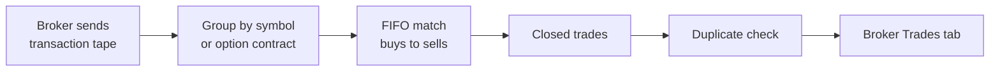

Once a brokerage is connected, Tradion rebuilds your closed trades from your account history into the **Broker Trades** tab. You stop typing prices and times, and spend that effort on the part your broker cannot supply.

<Info>
  Import needs a [connected brokerage](/portfolio/connect-brokerage). Trade Autopsy itself is included on **Starter** and above.
</Info>

## How import runs

Import is automatic. There is no button you press and no date range you pick.

Tradion pulls your account activity and rebuilds trades at three moments:

- When you first connect a brokerage.
- When you press refresh on a connection under **Settings → Connected Brokerages**.
- When your broker notifies Tradion that new activity has settled.

## What a transaction tape is, and why matching is needed

A **transaction tape** is the running list of individual fills your broker keeps for your account. Brokers do not store "trades" — they store a buy here, a sell there, each with a date, a price, a size, and a fee. A round trip you think of as one trade might be four rows on the tape.

Tradion turns that list back into trades using **FIFO**, first in, first out.

### FIFO in plain English

Line your purchases of a symbol up in a queue, in the order you made them. A sale closes the oldest purchase at the front. If the sale is bigger, the leftover moves on to the next one. If the purchase is bigger, the remainder stays at the front for the next sale.

It's the rule most brokers and tax authorities use to work out **cost basis** — what a holding is treated as having cost you — so the trades Tradion rebuilds generally line up with your statement.

## Partial fills and scaled exits

Two things that break naive matching, and how FIFO handles them:

- A **partial fill** is one order your broker executes in several pieces at slightly different prices. It arrives as several transactions. FIFO stacks them in order, so the rebuilt entry price comes from the pieces your exit consumed.
- A **scaled exit** is closing a position in more than one sale — a third off here, a third there. Each sale eats forward through the queue, producing one closed trade per matched pair.

If a sale is larger than everything left in the queue, the excess is treated as opening a new position in the opposite direction, which is what it is.

Only completed round trips appear. A position you still hold has no closing transaction to match against, so its gain or loss is still **unrealised** — on paper, not banked — and it lives in [Portfolio](/portfolio/overview) instead.

## Options matching

Options are grouped by the full contract, not by the underlying ticker. The underlying, expiry, strike, and call-or-put all have to agree before two transactions can match, so a 450 call never pairs against a 460 call and this week's expiry never matches next week's.

Profit and loss applies the contract multiplier: 100 shares per contract for standard options, 10 for mini options.

<Note>
  Tradion checks the contract identifier before the description, so that options-strategy ETFs — funds that sell options as a strategy — don't get misfiled as options trades. They're shares, and they import as shares.
</Note>

## Duplicates

Every rebuilt trade carries a fingerprint made from the identifiers of its opening and closing transactions, checked against your own account only. Re-syncing the same period does not create a second copy, a duplicate is reported as skipped rather than as an error, and a broker that later restates a price or a fee updates the existing trade instead of adding one.

If you logged the trade by hand before it imported, you'll have two records. Delete whichever you don't want from the **Trade Log** tab.

## What import cannot recover

Your broker knows what you did. It does not know why. Import gives you accurate prices, sizes, and timestamps, and nothing at all about:

- What setup you thought you were taking.
- Where your stop was, and whether you moved it.
- Your **position sizing** decision — how large a position you took relative to what you were willing to lose — and what drove it.
- Whether you followed your plan.
- What state you were in.

Those are the fields a root-cause analysis is built from. Imported trades arrive with the plan-followed flag unset, because nobody has answered the question yet.

So import is half the job. The other half is a minute of typing.

<Steps>
  <Step title="Open the Broker Trades tab">
    Filter to **Losses** if you want the highest-value reviews first.
  </Step>
  <Step title="Press Run Autopsy on a trade">
    Tradion pre-fills a narrative from the imported numbers and drops you into the Trade Log intake.
  </Step>
  <Step title="Add what the broker couldn't know">
    Append your reasoning, your plan, and your state of mind before you continue. [Logging a trade](/trade-intelligence/logging-a-trade) has a worked example.
  </Step>
  <Step title="Answer the follow-up questions and read the report">
    Trades reviewed this way score a much higher data confidence than the raw numbers alone.
  </Step>
</Steps>

## When nothing shows up

| What you see | What it means |
| --- | --- |
| **No Brokerage Connected** | Connect one under **Settings → Connected Brokerages** |
| **No Broker Trades Yet** with a broker connected | Nothing has synced. Press refresh on the connection |
| A trade you made is missing | The position is still open, or the closing transaction hasn't settled at your broker |
| Prices look slightly off | Some brokers report only the total cash amount, with no per-unit price. Tradion derives the price from that total — check it against your statement before autopsying |

<CardGroup cols={2}>
  <Card title="Connect a brokerage" icon="link" href="/portfolio/connect-brokerage">
    Setup, supported brokers, and what Tradion reads.
  </Card>
  <Card title="Add the missing context" icon="pen-to-square" href="/trade-intelligence/logging-a-trade">
    Why the reasoning field carries the whole analysis.
  </Card>
</CardGroup>
