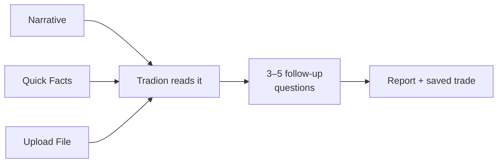

Everything in [Trade Autopsy](/trade-intelligence/trade-autopsy) is built on what you log. This page covers the three ways to get a closed trade in, which fields matter, and what each changes about the report you get back.

Start from **Trade Autopsy → New Autopsy → Manual Entry**, or from the **Trade Log** tab.

## The three intake modes

### Narrative

A single text box. Write what happened in your own words. Tradion pulls out the ticker, instrument, direction, times, prices, quantity, and outcome, then asks about whatever it couldn't determine.

If you only use one mode, use this one. The numbers matter, but the reasoning is what produces a report worth reading, and this is the only mode where reasoning is the main input. Four worked examples sit under the box, click one to see the shape of a usable narrative.

### Quick Facts

A structured form for when you have the numbers in front of you and don't feel like writing prose.

Fields: **Ticker** · **Instrument** (Options, Shares, Futures, Crypto) · **Date** · **Timezone** · **Entry Price** · **Entry Time** · **Quantity** · **Exit Price** · **Exit Time** · **Outcome (P&L)** · a checkbox for *"Times are approximate"* · and a free-text box asking what happened, why you entered, and what went wrong.

Only **Ticker** is enforced before you can continue. Anything else missing becomes a follow-up question or an inference, and the report tells you which is which.

### Upload File

Drop in a screenshot or a PDF of a broker confirmation, order fills, or a daily summary. Tradion reads it, extracts every trade it finds, and removes obvious duplicates.

Images and PDFs only, **10 MB maximum**. One trade takes you straight into the report flow; several give you a table to pick from, with a box on each row for adding context. Use that box.

<Warning>
  Upload is reading pixels. Check the extracted numbers first, a misread strike or a transposed price produces a confident report about a trade that didn't happen.
</Warning>

### In plain English

All three modes end in the same place: a set of fields describing one closed trade. They differ only in who fills the fields in: Tradion reads them out of your writing, you type them, or Tradion reads them off an image.

Anything still blank becomes one of the 3–5 multiple-choice questions before the report runs, so nothing is left out quietly.

## What a good narrative looks like

Compare these two descriptions of the same trade.

**Not enough to work with:**

> Took NVDA long, got stopped out. Bad day.

**Enough to work with:**

> NVDA long, Tuesday morning. Bought the break of the opening range around 10:05 because volume was expanding and I'd been watching it since the bell. Plan was a stop under the opening low and a target near the prior day's high, about 3:1 reward to risk. I was already red on the day from a SPY trade, so I sized roughly double what I normally take. It stalled, came back through my entry, and I held it past my stop because I wanted the day back. Closed it manually about 40 minutes later, down around 6% on the position. Felt rushed the whole way through.

The second version is around ninety seconds of typing. It carries the setup, the plan, the deviation from it, the sizing decision and the reason behind it, and the emotional state. That's the material a root-cause analysis is made of.

<Note>
  Percentages and ratios are enough. You never need to type an account balance for the analysis to work. **R:R** (risk to reward, the ratio between what you stood to lose and what you stood to gain) and percentage moves carry the same information.
</Note>

## Required, optional, and inferred

| Field | Status | If you leave it out |
| --- | --- | --- |
| Ticker | Required | You can't continue |
| Instrument, direction, prices, times, quantity, outcome | Needed for the report | Tradion asks, or marks it inferred, worked out from something else you said |
| Entry reason, exit reason, emotional state | Optional in the database, decisive in practice | The report leans on inference and its confidence drops |
| Fees, notes, chart screenshot | Optional | No effect on the analysis |

Every report includes a **Data Confidence** panel counting how many fields were known, inferred, assumed, or missing. Thin input produces a low number there, and the report says so.

## Options trades

Choose **Options** as the instrument and three fields appear: **Strike**, **Type** (Call or Put), and **Expiration**. Expiration is free text, so `0DTE`, `Feb 21`, or a full date all work. Quantity is in contracts.

If the loss came from the option losing value while the stock went your way, say so in the narrative. That's a different failure from a directional call being wrong, and the report treats them differently.

## What the state-of-mind field adds

Prices tell Tradion what happened. They cannot tell it **why**. "Held past my stop" and "held past my stop because I was down on the day and wanted it back" are the same row of numbers and two different problems, one is a rule you don't trust, the other is a state you trade badly in.

Your recorded states are also one of the five inputs behind the Psychological Profile in [Tradion Memory](/concepts/tradion-memory), which is what lets Tradion note that a setup resembles one you've historically handled badly.

One word is enough. "Annoyed", "impatient", "certain", "bored".

## Deleting a trade

Each row in **Trade Log** has a delete control. Deleting a trade removes its autopsy with it, and cannot be undone.

There is no way to edit a logged trade in place. If the numbers came out wrong, delete it and log it again.

<CardGroup cols={2}>
  <Card title="Import from your broker" icon="download" href="/trade-intelligence/importing-broker-trades">
    Let your account history fill in the numbers.
  </Card>
  <Card title="Reading an autopsy" icon="file-magnifying-glass" href="/trade-intelligence/reading-an-autopsy">
    What comes back, and what each section measures.
  </Card>
</CardGroup>
