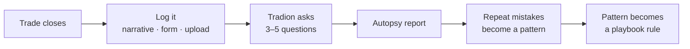

Trade Autopsy turns a closed trade into a written record, what you did, in what order, what it cost, and which habits keep showing up.

<Info>
  Trade Autopsy is included on **Starter** and above, with no monthly cap. Run one on every closed trade if you like. See the [plan comparison](/reference/plan-comparison).
</Info>

<Frame caption="The Overview tab: your three scores, the trades you have logged, the patterns that keep repeating, and your pre-flight card.">
  
</Frame>

## What an autopsy is

A structured post-mortem of one closed trade. You give Tradion what happened; it returns a report with the same fixed sections every time, a reconstructed timeline, a breakdown of what the result is attributable to, three 0–100 scores, alternative versions of the trade, and one rule to carry forward.

### In plain English

One report tells you about one trade, and markets are noisy enough that a single sample proves little. Ten reports in an identical format are what make a repeated mistake visible.

The report keeps **process** and **outcome** apart on purpose. A win taken on a broken process and a loss taken correctly look nothing alike, and the report grades both so you can see when the two disagree.

## The five tabs

| Tab | What's in it |
| --- | --- |
| **Overview** | Your three running scores, each with a sparkline (a tiny line chart of recent values, read for shape). Also a process-versus-outcome scatter (one dot per trade, plotted against both grades) setup performance, recent autopsies, your winning patterns ("Your Edge"), your losing patterns ("Mistake Patterns"), and a Pre-Flight Checklist card |
| **Trade Log** | Everything you've logged, filterable by all / wins / losses. Also where you log a new trade and where reports open |
| **Broker Trades** | Trades rebuilt automatically from a [connected brokerage](/portfolio/connect-brokerage), each with a **Run Autopsy** button |
| **Autopsies** | Completed reports only, filtered by severity, Tradion's rating of how damaging it judged the mistake, from low to critical |
| **Playbook** | The rules you've saved, each with a trigger and a checklist |

## Getting trades in

Four routes, and you'll probably use all of them.

<CardGroup cols={2}>
  <Card title="Narrative" icon="pen-to-square" href="/trade-intelligence/logging-a-trade">
    Type what happened. Tradion pulls the facts out of it.
  </Card>
  <Card title="Quick Facts" icon="table-list" href="/trade-intelligence/logging-a-trade">
    A form. Fastest when you have the numbers to hand.
  </Card>
  <Card title="Upload File" icon="file-arrow-up" href="/trade-intelligence/logging-a-trade">
    A screenshot or PDF of a broker confirmation.
  </Card>
  <Card title="Import from your broker" icon="download" href="/trade-intelligence/importing-broker-trades">
    Closed trades rebuilt from your account history.
  </Card>
</CardGroup>

## Running your first autopsy

<Steps>
  <Step title="Open Trade Autopsy and click New Autopsy">
    Pick **Manual Entry** to type or upload, or **From Brokerage** to work from an imported trade.
  </Step>
  <Step title="Describe the trade">
    A few sentences is enough: the ticker, why you entered, what your plan was, what you did, and how you felt. That last part matters more than it sounds, [logging a trade](/trade-intelligence/logging-a-trade) explains why.
  </Step>
  <Step title="Answer the follow-up questions">
    Tradion asks 3–5 multiple-choice questions about the parts it couldn't determine, usually your stop, your sizing, and your state of mind. Each has an **Other** option.
  </Step>
  <Step title="Read the report">
    Roughly 30–60 seconds later. [Reading an autopsy](/trade-intelligence/reading-an-autopsy) walks through every section.
  </Step>
  <Step title="Save the lesson">
    Every report ends with one rule. **Save to Playbook** puts it somewhere you'll see it again.
  </Step>
</Steps>

<Check>The trade and its report are both saved. The report appears under **Autopsies**, and the trade under **Trade Log**.</Check>

## How patterns emerge

Each report tags the trade with the mistakes it found, and those tags are what patterns are built from. Nothing is learning here, Tradion groups identical tags, counts, and ranks them.

Once a tag appears on more than one losing trade it becomes a **pattern**, carrying how often it happened, what those trades lost in total, and a **severity** score from 0 to 100.

### How severity is scored

Two parts, added together.

- **How often it happens** is worth up to 60 points, measured against every trade you have reviewed. A tag on every reviewed trade takes all 60; a tag on a tenth of them takes 6.
- **What it costs** is worth up to 40 points, measured against your most expensive pattern. Your costliest pattern takes all 40; one that has cost half as much takes 20.

A pattern near 100 is both frequent and expensive. One near 20 is rare, cheap, or both.

Tradion saves a copy of your patterns daily, which is how it can also say which way one is heading. It will not call a pattern improving or worsening until it holds five of those copies spanning 30 days or more; before that it reports insufficient data.

## Why roughly ten trades

Ten is where several things switch on at once:

- Below about **10 autopsies**, Tradion won't calculate a direction on your scores. There isn't enough to split into a "before" and an "after".
- Session analysis needs **5 trades in a given part of the day** before showing a win rate for that window.
- At **20 autopsies**, trend arrows and score changes appear, and [Tradion Memory](/concepts/tradion-memory) moves from low to moderate confidence.

Below ten, the reports are about individual trades. Above ten, they start being about you.

<Tip>
  Autopsy your winners too. A winning trade with a poor process score is the most useful thing this tool finds, because it's the one you'd never have questioned.
</Tip>

<CardGroup cols={2}>
  <Card title="Log your first trade" icon="pen-to-square" href="/trade-intelligence/logging-a-trade">
    The three intake modes, and what to write.
  </Card>
  <Card title="Reading an autopsy" icon="file-magnifying-glass" href="/trade-intelligence/reading-an-autopsy">
    Every section of the report and what to do with it.
  </Card>
</CardGroup>
